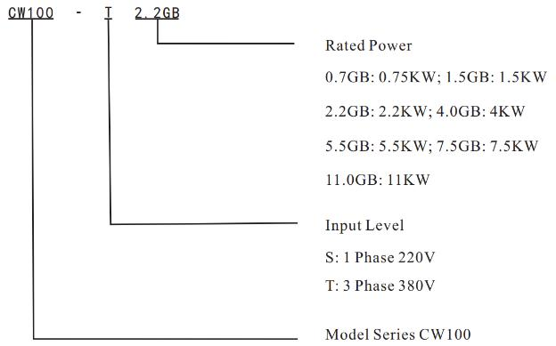
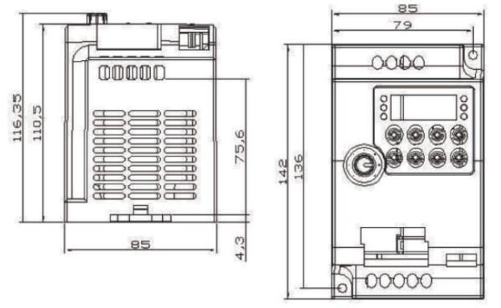
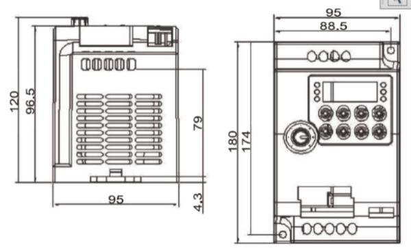
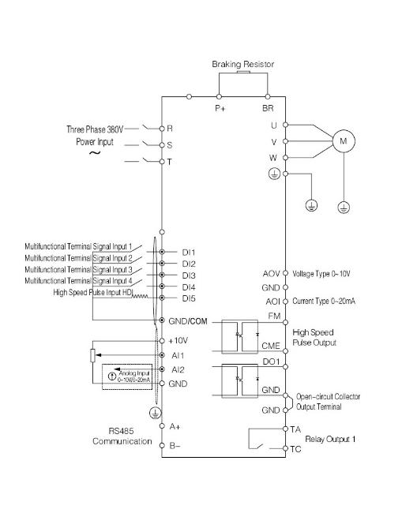
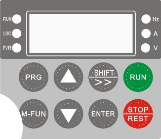

# CW100 Series Frequency Inverter User Manual

**CTRL-DRIVE CW100 Series VFD English Manual V1.0**

Thank you for purchasing the VFD.

Read and understand the manual before use and forward the manual to the end user.

Before use, please read **the safety precautions** carefully.

Please keep this manual carefully for consulting if necessary. If you have any doubt, please contact our customer service or technical support, our professional will serve you wholeheartedly.

This manual provides information about CW100 series frequency inverters, including:

- Safety information and precautions
- Installation and inspection
- Wiring instruction
- Operation instruction
- Communication protocol specification
- Maintenance and troubleshooting

This manual is suitable for the following users:

- System design and selection personnel
- Installation or wiring personnel
- Debugging personnel
- Maintenance personnel

> Source: [Scribd — CTRL-DRIVE CW100 Series VFD English Manual V1.0](https://ru.scribd.com/document/713397016/CTRL-DRIVE-CW100-Series-VFD-English-Manual-V1-0-Replicable4). Full text converted from the identical 44-page manufacturer PDF: [CNCDrive VFD CW100 manual](https://shop.cncdrive.hu/cmproductsdownloader.php?field=document1&product=1265-cw-100-frekvenciavalto-4-kw-motorhoz-3-fazisu) (also published as `https://cncdrive.com/downloads/VFD%20CW100_manual.pdf`).

---

## Contents

- [Chapter 1 Safety Information and Precautions](#chapter-1-safety-information-and-precautions)
  - [1.1 Safety Information and Precautions](#11-safety-information-and-precautions)
  - [1.2 Operation Precautions](#12-operation-precautions)
- [Chapter 2 Product Information](#chapter-2-product-information)
  - [2.1 Designation Rules](#21-designation-rules)
  - [2.2 Technical Specifications](#22-technical-specifications)
  - [2.3 Installation Environment Requirements](#23-installation-environment-requirements)
- [Chapter 3 Installation Guide](#chapter-3-installation-guide)
  - [3.1 Product Size Diagram](#31-product-size-diagram)
  - [3.2 Product Installation Diagram](#32-product-installation-diagram)
- [Chapter 4 Wiring Instructions](#chapter-4-wiring-instructions)
  - [4.1 Interface and Terminal Instructions](#41-interface-and-terminal-instructions)
  - [4.2 Reference Wiring Diagram](#42-reference-wiring-diagram)
- [Chapter 5 Operation Panel](#chapter-5-operation-panel)
  - [5.1 Appearance Diagram](#51-appearance-diagram)
  - [5.2 Description of Indicators](#52-description-of-indicators)
  - [5.3 Description of Keys on the Operation Panel](#53-description-of-keys-on-the-operation-panel)
- [Chapter 6 Function Parameter Table](#chapter-6-function-parameter-table)
- [Chapter 7 Maintenance and Troubleshooting](#chapter-7-maintenance-and-troubleshooting)
  - [7.1 Fault Description](#71-fault-description)
  - [7.2 Troubleshooting List](#72-troubleshooting-list)
  - [7.3 Faults and Solutions](#73-faults-and-solutions)
  - [7.4 Braking Resistance Specification](#74-braking-resistance-specification)

---

## Chapter 1 Safety Information and Precautions

### 1.1 Safety Information and Precautions

- It is forbidden to use the device near water, corrosive gas, combustible gas, inflammable and explosive materials, otherwise it will cause electric shock, combustion or explosion.
- Prohibit the use of this device in places that restrict or prohibit the use of this device, otherwise it may lead to an accident.
- The high voltage of the frequency inverter will remain for a period of time after the power is off. Please do not remove the wire or touch the terminal within 3 minutes of power off, otherwise there is a danger of electric shock.
- Make sure that the earth terminal of the inverter is grounded reliably. Otherwise, there is a risk of electric shock.
- Do not contact with the internal components and circuits of the frequency inverter. Otherwise, there is a risk of electric shock.
- It is forbidden to modify the internal parts or circuits of the frequency inverter.
- This series of inverters are used to control ordinary asynchronous motor and frequency conversion asynchronous motor, not for single-phase motor and other applications.
- Do not use damaged inverter, otherwise it may cause an accident.
- Please select a safe position to install servo inverter to prevent direct exposure to high temperature and sunlight, avoid dampness, splash of water droplets and erosion of various oils, avoid metal powder or iron chips into the inverter.

### 1.2 Operation Precautions

- It must be connected, installed and operated by a professional.
- Wiring shall not be connected when the power supply is turned on, otherwise it may cause electrical shock or injury to personnel.
- Terminal voltage and polarity must be applied to prevent damage to equipment or injury to personnel.
- Please do not pass the power line and signal line through the same pipe, and do not tie them together.
- Frequency inverter must be matched with the asynchronous motor, and maintain good heat-dissipation conditions.
- Do not touch the heat sink and brake resistor of the inverter while running, otherwise you may burn.
- Please do not switch power supply frequently, it is best to control the interval of more than 1 minute.
- The AC power supply is prohibited from being connected to the output terminals U, V, W of the frequency inverter, otherwise the internal damage of the frequency inverter can be caused.

---

## Chapter 2 Product Information

Upon receipt of the goods, please examine the following items carefully:

- Whether the type of frequency inverter is correct.
- Whether the appearance is damaged.

### 2.1 Designation Rules

**Model Number Instruction**

Example: `CW100-T2.2GB`

| Segment | Meaning | Codes |
| --- | --- | --- |
| CW100 | Model series | CW100 |
| T | Input level | **S** — 1 phase 220 V; **T** — 3 phase 380 V |
| 2.2GB | Rated power | **0.7GB** — 0.75 kW; **1.5GB** — 1.5 kW; **2.2GB** — 2.2 kW; **4.0GB** — 4 kW; **5.5GB** — 5.5 kW; **7.5GB** — 7.5 kW; **11.0GB** — 11 kW |

### 2.2 Technical Specifications

| Model | Power supply capacity (kVA) | Input current (A) | Output current (A) | Adaptable motor (kW) | Adaptable motor (HP) |
| --- | ---: | ---: | ---: | ---: | ---: |
| **One-phase power supply: 220 V, 50 Hz / 60 Hz** | | | | | |
| CW100-0D75-1 | 1.5 | 8.2 | 4.0 | 0.75 | 1 |
| CW100-1D5-1 | 3.0 | 14.0 | 7.0 | 1.5 | 2 |
| CW100-2D2-1 | 4.0 | 23.0 | 9.6 | 2.2 | 3 |
| **Three-phase power supply: 380 V, 50 Hz / 60 Hz** | | | | | |
| CW100-0D75-4 | 1.5 | 3.4 | 2.1 | 0.75 | 1 |
| CW100-1D5-4 | 3.0 | 5.0 | 3.8 | 1.5 | 2 |
| CW100-2D2-4 | 4.0 | 5.8 | 5.1 | 2.2 | 3 |
| CW100-4D0-4 | 5.9 | 10.5 | 9.0 | 4.0 | 5 |
| CW100-5D5-4 | 8.9 | 14.6 | 13.0 | 5.5 | 7.5 |
| CW100-7D5-4 | 11.0 | 20.5 | 17.0 | 7.5 | 10 |
| CW100-11D0-4 | 17.0 | 26.0 | 25.0 | 11.0 | 15 |

### 2.3 Installation Environment Requirements

| Item | Requirement |
| --- | --- |
| Ingress protection grade | IP20 |
| Installation height | The maximum is 1000 m (3280 ft) at sea level. If the installation height is above this value, the current should be reduced by 1.2% for every 10 m (328 ft) increase in height. |
| Ambient temperature at running | 0–40 °C (32–104 °F) |
| Temperature at storage | −20–55 °C (−4–131 °F) |
| Temperature at transportation | −20–60 °C (−4–140 °F) |
| Air humidity at running | 5%–85%, no condensation or freezing |
| Air humidity at storage | 5%–95% |

---

## Chapter 3 Installation Guide

### 3.1 Product Size Diagram

Installation dimension diagram of outer panel. Mounting hole dimension: **82 × 61 mm**.

Outer panel outline: **66 × 87 mm**, with four corner mounting holes.

### 3.2 Product Installation Diagram

#### CW100-0.75 kW–2.2 kW

Approximate dimensions from the drawing: width **85 mm**, height **142 mm**, depth about **110.5–116.35 mm** (including panel knob). Mounting hole spacing about **79 × 136 mm**.

#### CW100-4 kW–5.5 kW

Approximate dimensions from the drawing: width **95 mm**, height **180 mm**, depth about **96.5–120 mm**. Mounting hole spacing about **88.5 × 174 mm**.

#### CW100-7.5 kW–11.0 kW

Approximate dimensions from the drawing: width **107 mm**, height **240 mm**, mounting hole spacing about **96 × 230 mm**.

---

## Chapter 4 Wiring Instructions

### 4.1 Interface and Terminal Instructions

#### 4.1.1 Main Circuit Terminals

**Table 4-1. Interface and terminal function description**

| Terminal | Name | Function description |
| --- | --- | --- |
| R, S, T | AC power input terminal | Connect the input three-phase AC power supply. For 220 V single-phase, connect R and T. |
| P+, PB | Brake resistor terminal | Connect brake resistor. |
| U, V, W | Output terminal | Connect three-phase motor. |
| ⊕ | Earth terminal | Grounding connection. |

#### 4.1.2 Control Circuit Terminals

**Table 4-2. CW100 description of control circuit terminals**

| Item | Terminal | Name | Function description |
| --- | --- | --- | --- |
| Power supply | 10V–GND | External 10 V power supply | Provide +10 V power supply to external unit. Generally, it provides power supply to external potentiometer with resistance range of 1–5 kΩ. Maximum output current: 10 mA. |
| Power supply | 24V–GND | External 24 V power supply | Provide +24 V power supply to external unit. Generally, it provides power supply to DI/DO terminals and external sensors. Maximum output current: 200 mA. |
| Analog input | AI1–GND | Analog input terminal 1 | Input range: DC 0 V–10 V / 0 mA–20 mA, decided by P4-39. Resistance input: 22 kΩ (voltage input), 500 Ω (current input). |
| Digital input | DI1–GND | Digital input 1 | Resistance input: 1 kΩ. |
| Digital input | DI2–GND | Digital input 2 | Voltage range for level input: 5–30 V. |
| Digital input | DI3–GND | Digital input 3 | Voltage range for level input: 5–30 V. |
| Digital input | DI4–GND | Digital input 4 | Voltage range for level input: 5–30 V. |
| Digital input | DI5–GND | High-speed pulse input terminal | Besides features of DI1–DI4, it can be used for high-speed pulse input. Maximum input frequency: 20 kHz. |
| Analog output | AOV–GND | Analog output | Output voltage range: 0–10 V. |
| Analog output | AOI–GND | Analog output | Output current range: 0–20 mA. |
| Digital output | DO1–GND | Digital output 1 | Optical coupling isolation, dual polarity open collector output. Output voltage range: 0–24 V. Output current range: 0–50 mA. |
| Digital output | FM–GND | High-speed pulse output | It is limited by F5-00 (FM terminal output mode selection). As high-speed pulse output, the maximum frequency hits 20 kHz. As open-collector output, its specification is the same as that of DO1. |
| Relay | TA–TC | Relay NO terminal | Contact driving capacity: 250 Vac, 3 A, COSØ = 0.4; 30 Vdc, 1 A. |
| Communication | A+–B− | 485 communication terminal | MODBUS-RTU protocol communication input and output signal terminals. |

### 4.2 Reference Wiring Diagram

Power and motor (top of the drive):

- **R, S, T** — three-phase 380 V power input (or single-phase 220 V on R and T).
- **P+, BR/PB** — braking resistor.
- **U, V, W** — motor **M**.
- Chassis and motor earth terminals must be grounded.

Control terminals (typical layout on the drawing):

- **DI1–DI4** — multifunctional terminal signal inputs 1–4.
- **DI5** — high-speed pulse input HDI.
- **+10V, AI1, AI2, GND** — analog reference and analog inputs 0–10 V / 0–20 mA (AI1 shown with a potentiometer).
- **A+, B−** — RS485 communication.
- **AOV** — voltage-type analog output 0–10 V; **AOI** — current-type analog output 0–20 mA.
- **FM, CME** — high-speed pulse output (optocoupler).
- **DO1, GND** — open-collector output (optocoupler).
- **TA, TC** — relay output 1 (normally open).

---

## Chapter 5 Operation Panel

### 5.1 Appearance Diagram

### 5.2 Description of Indicators

1. **RUN:** ON indicates that the AC drive is in the running state, and OFF indicates that the AC drive is in the stop state.
2. **LOC:** It indicates whether the AC drive is operated by means of operation panel, terminals or communication.
3. **F/R:** ON indicates reverse rotation.
4. **Hz, A, V:** Unit indicators. They indicate the temporary display unit, which has the following units:
   - **Hz:** unit of frequency
   - **A:** unit of current
   - **V:** unit of voltage
   - **Hz + A:** unit of rotational speed
   - **A + V:** % percentage

### 5.3 Description of Keys on the Operation Panel

| Key | Name | Function |
| --- | --- | --- |
| PROG / PRG | Programming | Enter or exit Level I menu. |
| M-FUN | Multifunction selection | Function switch selection. It can be defined as a command source, or as a fast direction switch, according to P7-01. |
| ▲ | Increment | Increase data or function code. |
| ▼ | Decrement | Decrease data or function code. |
| SHIFT | Shift | Select the displayed parameters in turn in the stop or running state, and select the digit to be modified when modifying parameters. |
| ENTER | Confirm | Enter the menu interfaces level by level, and confirm the parameter setting. |
| RUN | Run | Start the AC drive in the operation panel control mode. |
| STOP / REST | Stop | Stop the AC drive when it is in the running state and perform the reset operation when it is in the fault state. The functions of this key are restricted in P7-02. |

---

## Chapter 6 Function Parameter Table

### 6.1 Brief introduction of function code

If **PP-00** is set to a non-zero number, parameter protection is enabled. You must enter the correct user password to enter the menu. To cancel the password protection function, enter with password and set **PP-00** to 0.

> The printed manual also writes “FP-00” in this sentence; the function-code table itself uses **PP-00** for the user password.

Group **P** and Group **A** are standard function parameters. Group **U** is the monitoring function parameters.

The symbols in the function code table are described as follows:

| Symbol | Meaning |
| --- | --- |
| ☆ | The parameter can be modified when the AC drive is in either stop or running state. |
| ★ | The parameter cannot be modified when the AC drive is in the running state. |
| ● | The parameter is the actually measured value and cannot be modified. |
| \* | The parameter is factory parameter and can be set only by the manufacturer. |

**Table 6-1. Standard function parameters**

### P0 Standard Function Parameters

| Function code | Parameter name | Setting range | Default | Property |
| --- | --- | --- | --- | --- |
| P0-01 | Motor control mode | 0: Sensorless flux vector control (SFVC) 2: V/F control | 2 | ★ |
| P0-02 | Command source selection | 0: Operation panel control (LED off) 1: Terminal control (LED on) 2: Communication control (LED blinking) | 0 | ☆ |
| P0-03 | Main frequency source X selection | 0: Digital setting (preset frequency P0-08, press UP/DOWN to modify, non-retentive at power failure) 1: Digital setting (preset frequency P0-08, press UP/DOWN to modify, retentive at power failure) 2: AI1 3: AI2 local potentiometer 4: Panel potentiometer / external keyboard potentiometer 5: HDI pulse setting (DI5) 6: Multi-command 7: Simple PLC 8: PID 9: Communication setting | 3 | ★ |
| P0-04 | Auxiliary frequency source Y selection | The same as P0-03 (Main frequency source X selection) | 0 | ★ |
| P0-05 | Selection of Y range of auxiliary frequency source in superposition | 0: Relative to maximum frequency 1: Relative to main frequency X | 0 | ☆ |
| P0-06 | Selection of Y range of auxiliary frequency source in superposition | 0% ～ 150% | 100% | ☆ |
| P0-07 | Frequency source superposition selection | Unit's digit (Frequency source selection) 0: Main frequency source X 1: X and Y operation (operation relationship determined by ten's digit) 2: Switchover between X and Y 3: Switchover between X and “X and Y operation” 4: Switchover between Y and “X and Y operation” Ten's digit (X and Y operation relationship) 0: X+Y 1: X−Y 2: Maximum 3: Minimum | 00 | ☆ |
| P0-08 | Preset frequency | 0.00 Hz ～ maximum frequency (P0-10) | 50.00 Hz | ☆ |
| P0-09 | Rotation direction | 0: Same direction 1: Reverse direction | 0 | ☆ |
| P0-10 | Maximum frequency | 5.00 Hz ～ 500.00 Hz | 50.00 Hz | ★ |
| P0-11 | Source of frequency upper limit | 0: Set by P0-12 1: AI1 2: AI2 local potentiometer 3: AI3 panel potentiometer / external keyboard potentiometer 4: HDI pulse setting 5: Communication setting | 0 | ★ |
| P0-12 | Frequency upper limit | Frequency lower limit (P0-14) to maximum frequency (P0-10) | 50.00 Hz | ☆ |
| P0-13 | Frequency upper limit offset | 0.00 Hz ～ maximum frequency P0-10 | 0.00 Hz | ☆ |
| P0-14 | Frequency lower limit | 0.00 Hz ～ frequency upper limit P0-12 | 0.00 Hz | ☆ |
| P0-15 | Carrier frequency | 2.0 kHz ～ 8.0 kHz | Model dependent | ☆ |
| P0-16 | Carrier frequency adjustment with temperature | 0: No 1: Yes | 1 | ☆ |
| P0-17 | Acceleration time 1 | 0.00 s ～ 650.00 s (P0-19=2) 0.0 s ～ 6500.0 s (P0-19=1) 0 s ～ 65000 s (P0-19=0) | Model dependent | ☆ |
| P0-18 | Deceleration time 1 | 0.00 s ～ 650.00 s (P0-19=2) 0.0 s ～ 6500.0 s (P0-19=1) 0 s ～ 65000 s (P0-19=0) | Model dependent | ☆ |
| P0-19 | Acceleration/Deceleration time unit | 0: 1 s 1: 0.1 s 2: 0.01 s | 1 | ★ |
| P0-21 | Frequency offset of auxiliary frequency source for X and Y operation | 0.00 Hz ～ maximum frequency P0-10 | 0.00 Hz | ☆ |
| P0-22 | Frequency reference resolution | 2: 0.01 Hz | 2 | ★ |
| P0-23 | Retentive of digital setting frequency upon power failure | 0: Not retentive 1: Retentive | 1 | ☆ |
| P0-25 | Acceleration/Deceleration time base frequency | 0: Maximum frequency (P0-10) 1: Set frequency 2: 100 Hz | 0 | ★ |
| P0-26 | Base frequency for UP/DOWN modification during running | 0: Running frequency 1: Set frequency | 0 | ★ |
| P0-27 | Binding command source to frequency source | Unit's digit (Binding operation panel command to frequency source) 0: No binding 1: Frequency source by digital setting 2: AI1 3: AI2 4: Panel potentiometer / external keyboard potentiometer 5: HDI Pulse setting (DI5) 6: Multi-command 7: Simple PLC 8: PID 9: Communication setting Ten's digit (Binding terminal command to frequency source) Hundred's digit (Binding communication command to frequency source) | 0000 | ☆ |

### P1 Motor Parameters

| Function code | Parameter name | Setting range | Default | Property |
| --- | --- | --- | --- | --- |
| P1-00 | Motor type selection | 0: Common asynchronous motor 2: Permanent magnetic synchronous motor | 0 | ★ |
| P1-01 | Rated motor power | 0.1 kW ～ 1000.0 kW | Model dependent | ★ |
| P1-02 | Rated motor voltage | 1 V ～ 2000 V | Model dependent | ★ |
| P1-03 | Rated motor current | 0.01 A ～ 10.00 A (AC drive power ≤ 2.2 kW) | Model dependent | ★ |
| P1-04 | Rated motor frequency | 0.01 Hz ～ maximum frequency | Model dependent | ★ |
| P1-05 | Rated motor rotational speed | 1 rpm ～ 65535 rpm | Model dependent | ★ |
| P1-10 | No-load current (asynchronous motor) | 0.01 A ～ P1-03 | Model dependent | ★ |
| P1-37 | Auto-tuning selection | 0: No auto-tuning 1: Asynchronous motor static auto-tuning 2: Asynchronous motor complete auto-tuning | 0 | ★ |

### P2 Vector Control Parameters

| Function code | Parameter name | Setting range | Default | Property |
| --- | --- | --- | --- | --- |
| P2-00 | Speed loop proportional gain 1 | 1 ～ 100 | 30 | ☆ |
| P2-01 | Speed loop integral time 1 | 0.01 s ～ 10.00 s | 0.50 s | ☆ |
| P2-02 | Switchover frequency 1 | 0.00 ～ P2-05 | 5.00 Hz | ☆ |
| P2-03 | Speed loop proportional gain 2 | 1 ～ 100 | 20 | ☆ |
| P2-04 | Speed loop integral time 2 | 0.01 s ～ 10.00 s | 1.00 s | ☆ |
| P2-05 | Switchover frequency 2 | P2-02 ～ maximum output frequency | 10.00 Hz | ☆ |
| P2-06 | Vector control slip gain | 50% ～ 200% | 100% | ☆ |
| P2-07 | Time constant of speed loop filter | 0.000 s ～ 1.000 s | 0.050 s | ☆ |
| P2-09 | Torque upper limit source in speed control mode | 0: Function code setting at P2-10 1: AI1 2: AI2 3: Panel potentiometer / external keyboard potentiometer 4: HDI Pulse setting 5: Communication setting 6: MIN(AI1,AI2) 7: MAX(AI1,AI2) 1–7: The full range of options corresponds to P2-10 | 0 | ☆ |
| P2-10 | Digital setting of torque upper limit in speed control mode | 0.0% ～ 200.0% | 150.0% | ☆ |
| P2-13 | Excitation adjustment proportional gain | 0 ～ 60000 | 2000 | ☆ |
| P2-14 | Excitation adjustment integral gain | 0 ～ 60000 | 1300 | ☆ |
| P2-15 | Torque adjustment proportional gain | 0 ～ 60000 | 2000 | ☆ |
| P2-16 | Torque adjustment integral gain | 0 ～ 60000 | 1300 | ☆ |
| P2-17 | Speed loop integral property | Unit's digit: integral separation 0: Disabled 1: Enabled | 0 | ☆ |
| P2-20 | Maximum output voltage coefficient | 100% ～ 110% | 105% | ★ |
| P2-21 | Maximum torque coefficient in weak magnetic field | 50% ～ 200% | 100% | ☆ |

### P3 V/F Control Parameters

| Function code | Parameter name | Setting range | Default | Property |
| --- | --- | --- | --- | --- |
| P3-00 | VF curve setting | 0: Linear V/F 1: Multi-point V/F 2: Square V/F 3: 1.2 power V/F 4: 1.4 power V/F 6: 1.6 power V/F 8: 1.8 power V/F 9: Reserved 10: V/F complete separation 11: V/F half separation | 0 | ★ |
| P3-01 | Torque boost | 0.0%: (Automatic torque boost) 0.1% ～ 30.0% | Model dependent | ☆ |
| P3-02 | Cut-off frequency of torque boost | 0.00 Hz ～ maximum frequency | 50.00 Hz | ★ |
| P3-03 | Multi-point V/F frequency 1 | 0.00 Hz ～ P3-05 | 0.00 Hz | ★ |
| P3-04 | Multi-point V/F voltage 1 | 0.0% ～ 100.0% | 0.0% | ★ |
| P3-05 | Multi-point V/F frequency 2 | P3-03 ～ P3-07 | 0.00 Hz | ★ |
| P3-06 | Multi-point V/F voltage 2 | 0.0% ～ 100.0% | 0.0% | ★ |
| P3-07 | Multi-point V/F frequency 3 | P3-05 ～ rated motor frequency (P1-04) | 0.00 Hz | ★ |
| P3-08 | Multi-point V/F voltage 3 | 0.0% ～ 100.0% | 0.0% | ★ |
| P3-09 | V/F slip compensation gain | 0.0% ～ 200.0% | 0.0% | ☆ |
| P3-10 | VF over-excitation gain | 0 ～ 200 | 64 | ☆ |
| P3-11 | VF oscillation suppression gain | 0 ～ 100 | Model dependent | ☆ |

### P4 Input Terminals

DI1–DI5 share the same function list. Factory defaults: P4-00 = 1, P4-01 = 2, P4-02 = 4, P4-03 = 9, P4-04 = 12.

| Function code | Parameter name | Setting range | Default | Property |
| --- | --- | --- | --- | --- |
| P4-00 | DI1 terminal function selection | 0: No function 1: Forward RUN (FWD) or RUN 2: Reverse RUN (REV) or RUN direction 3: Three-line control 4: Forward JOG (FJOG) 5: Reverse JOG (RJOG) 6: Terminal UP 7: Terminal DOWN 8: Coast to stop 9: Fault reset (RESET) 10: RUN pause 11: Normally open (NO) input of external fault 12: Multi-reference terminal 1 13: Multi-reference terminal 2 14: Multi-reference terminal 3 15: Multi-reference terminal 4 16: Terminal 1 for acceleration/deceleration time selection 17: Terminal 2 for acceleration/deceleration time selection 18: Frequency source switchover 19: UP and DOWN setting clear (terminal, operation panel) 20: Command source switchover terminal 1 21: Acceleration/Deceleration prohibited 22: PID pause 23: PLC status reset 24: Swing pause 25: Counter input 26: Counter reset 27: Length count input 28: Length reset 29: Torque control prohibited 30: Pulse input (enabled only for DI5) 31: Reserved 32: Immediate DC braking 33: Normally closed (NC) input of external fault 34: Frequency modification enable 35: Reverse PID action direction 36: External STOP terminal 1 37: Command source switchover terminal 2 38: PID integral pause 39: Switchover between main frequency source X and preset frequency 40: Switchover between auxiliary frequency source Y and preset frequency 41: Reserved 42: Reserved 43: PID parameter switchover 44: User-defined fault 1 45: User-defined fault 2 46: Speed control/Torque control switchover 47: Emergency stop 48: External STOP terminal 2 49: Deceleration DC braking 50: Clear the current running time 51–59: Reserved | 1 | ★ |
| P4-01 | DI2 terminal function selection | Same as P4-00 | 2 | ★ |
| P4-02 | DI3 terminal function selection | Same as P4-00 | 4 | ★ |
| P4-03 | DI4 terminal function selection | Same as P4-00 | 9 | ★ |
| P4-04 | DI5 terminal function selection | Same as P4-00 | 12 | ★ |
| P4-10 | DI filter time | 0.000 s ～ 1.000 s | 0.01 s | ☆ |
| P4-11 | Terminal command mode | 0: Two-line mode 1 1: Two-line mode 2 2: Three-line mode 1 | 1 | ★ |
| P4-12 | Terminal UP/DOWN rate | 0.001 Hz/s ～ 65.535 Hz/s | 1.00 Hz/s | ☆ |
| P4-13 | AI curve 1 minimum input | 0.00 V ～ P4-15 | 0.00 V | ☆ |
| P4-14 | Corresponding setting of AI curve 1 minimum input | −100.0% ～ +100.0% | 0.0% | ☆ |
| P4-15 | AI curve 1 maximum input | P4-13 ～ +10.00 V | 10.00 V | ☆ |
| P4-16 | Corresponding setting of AI curve 1 maximum input | −100.0% ～ +100.0% | 100.0% | ☆ |
| P4-17 | AI1 filter time | 0.00 s ～ 10.00 s | 0.10 s | ☆ |
| P4-18 | AI curve 2 minimum input | 0.00 V ～ P4-20 | 0.00 V | ☆ |
| P4-19 | Corresponding setting of AI curve 2 minimum input | −100.0% ～ +100.0% | 0.0% | ☆ |
| P4-20 | AI curve 2 maximum input | P4-18 ～ +10.00 V | 10.00 V | ☆ |
| P4-21 | Corresponding setting of AI curve 2 maximum input | −100.0% ～ +100.0% | 100.0% | ☆ |
| P4-22 | AI2 filter time | 0.00 s ～ 10.00 s | 0.10 s | ☆ |
| P4-23 | AI curve 3 minimum input | −10.00 V ～ P4-25 | −10.00 V | ☆ |
| P4-24 | Corresponding setting of AI curve 3 minimum input | −100.0% ～ +100.0% | −100.0% | ☆ |
| P4-25 | AI curve 3 maximum input | P4-23 ～ +10.00 V | 10.00 V | ☆ |
| P4-26 | Corresponding setting of AI curve 3 maximum input | −100.0% ～ +100.0% | 100.0% | ☆ |
| P4-27 | Panel potentiometer filter time | 0.00 s ～ 10.00 s | 0.10 s | ☆ |
| P4-28 | HDI Pulse minimum input | 0.00 kHz ～ P4-30 | 0.00 kHz | ☆ |
| P4-29 | Corresponding setting of HDI minimum input | −100.0% ～ 100.0% | 0.0% | ☆ |
| P4-30 | HDI maximum input | P4-28 ～ 100.00 kHz | 50.00 kHz | ☆ |
| P4-31 | Corresponding setting of HDI pulse maximum input | −100.0% ～ 100.0% | 100.0% | ☆ |
| P4-32 | HDI filter time | 0.00 s ～ 10.00 s | 0.10 s | ☆ |
| P4-33 | AI curve selection | Unit's digit (AI1 curve selection) Curve 1 (2 points, see P4-13 to P4-16) Curve 2 (2 points, see P4-18 to P4-21) Curve 3 (2 points, see P4-23 to P4-26) Curve 4 (4 points, see A6-00 to A6-07) Curve 5 (4 points, see A6-08 to A6-15) Ten's digit (AI2 curve selection): Curve 1 to curve 5 (same as AI1) Hundred's digit (AI3 curve selection): Curve 1 to curve 5 (same as AI1) | 321 | ☆ |
| P4-34 | Setting for AI less than minimum input | Unit's digit (Setting for AI1 less than minimum input) 0: Minimum value 1: 0.0% Ten's digit (Setting for AI2 less than minimum input): 0, 1 (same as AI1) Hundred's digit (Setting for AI3 less than minimum input): 0, 1 (same as AI1) | 000 | ☆ |
| P4-35 | DI1 delay time | 0.0 s ～ 3600.0 s | 0.0 s | ★ |
| P4-36 | DI2 delay time | 0.0 s ～ 3600.0 s | 0.0 s | ★ |
| P4-37 | DI3 delay time | 0.0 s ～ 3600.0 s | 0.0 s | ★ |
| P4-38 | DI valid mode selection | 0: High level valid 1: Low level valid Unit's digit (DI1 valid mode) Ten's digit (DI2 valid mode) Hundred's digit (DI3 valid mode) Thousand's digit (DI4 valid mode) Ten thousand's digit (DI5 valid mode) | 00000 | ★ |
| P4-39 | AI1 input voltage/current selection | 0: Voltage input 1: Current input | 0 | ★ |

### P5 Output Terminals

| Function code | Parameter name | Setting range | Default | Property |
| --- | --- | --- | --- | --- |
| P5-00 | FM terminal output mode | 0: Pulse output (FMP) 1: Switch signal output (FMR) | 0 | ☆ |
| P5-01 | FMR output function selection | 0: No output 1: AC drive running 2: Fault output (stop) 3: Frequency-level detection FDT1 output 4: Frequency reached 5: Zero-speed running (no output at stop) 6: Motor overload pre-warning 7: AC drive overload pre-warning 8: Set count value reached 9: Designated count value reached 10: Length reached 11: PLC cycle complete 12: Accumulative running time reached 13: Frequency limited 14: Torque limited 15: Ready for RUN 16: AI1 > AI2 17: Frequency upper limit reached 18: Frequency lower limit reached (operation related) 19: Undervoltage state output 20: Communication setting 21: Reserved 22: Reserved 23: Zero-speed running 2 (having output at stop) 24: Accumulative power-on time reached 25: Frequency level detection FDT2 output 26: Frequency 1 reached output 27: Frequency 2 reached output 28: Current 1 reached output 29: Current 2 reached output 30: Timing reached output 31: AI1 input limit exceeded 32: Load becoming 0 33: Reverse running 34: Zero current state 35: IGBT temperature reached 36: Current limit exceeded 37: Frequency lower limit reached (having output at stop) 38: Alarm output 39: Motor overheat warning 40: Current running time reached 41: Fault output (There is no output if it is the coast to stop fault and undervoltage occurs.) | 2 | ☆ |
| P5-02 | Relay function (T/A–T/C) | Same list as P5-01 | 0 | ☆ |
| P5-04 | DO1 output function selection | Same list as P5-01 | 1 | ☆ |
| P5-06 | FMP output function selection | 0: Running frequency 1: Set frequency 2: Output current 3: Output torque (absolute value) 4: Output power 5: Output voltage 6: HDI input (100.0% corresponds to 100.0 kHz) 7: AI1 8: AI2 11: Count value 12: Communication setting 13: Motor rotational speed 14: Output current (100.0% corresponds to 1000.0 A) 15: Output voltage (100.0% corresponds to 1000.0 V) 16: Output torque (actual value) | 0 | ☆ |
| P5-08 | AO1 output function selection | Same list as P5-06 | 0 | ☆ |
| P5-09 | Maximum FMP output frequency | 0.01 kHz ～ 100.00 kHz | 50.00 kHz | ☆ |
| P5-12 | AO1 offset coefficient | −100.0% ～ +100.0% | 0.0% | ☆ |
| P5-13 | AO1 gain | −10.00 ～ +10.00 | 1.00 | ☆ |
| P5-17 | FMR output delay time | 0.0 s ～ 3600.0 s | 0.0 s | ☆ |
| P5-18 | Relay 1 output delay time | 0.0 s ～ 3600.0 s | 0.0 s | ☆ |
| P5-19 | Relay 2 output delay time | 0.0 s ～ 3600.0 s | 0.0 s | ☆ |
| P5-20 | DO1 output delay time | 0.0 s ～ 3600.0 s | 0.0 s | ☆ |

### P6 Start/Stop Control

| Function code | Parameter name | Setting range | Default | Property |
| --- | --- | --- | --- | --- |
| P6-00 | Start mode | 0: Direct start 1: Rotational speed tracking restart 2: Pre-excited start (asynchronous motor) | 0 | ☆ |
| P6-01 | Rotational speed tracking mode | 0: From frequency at stop 1: From power frequency 2: From maximum frequency | 0 | ★ |
| P6-02 | Rotational speed tracking speed | 1 ～ 100 | 20 | ☆ |
| P6-03 | Startup frequency | 0.00 Hz ～ 10.00 Hz | 0.00 Hz | ☆ |
| P6-04 | Startup frequency holding time | 0.0 s ～ 100.0 s | 0.0 s | ★ |
| P6-05 | Startup DC braking current / Pre-excited current | 0% ～ 100% | 0% | ★ |
| P6-06 | Startup DC braking time / Pre-excited time | 0.0 s ～ 100.0 s | 0.0 s | ★ |
| P6-07 | Acceleration/Deceleration mode | 0: Linear acceleration/deceleration 1: Static S-curve 2: Dynamic S-curve | 0 | ★ |
| P6-08 | Time proportion of S-curve start segment | 0.0% ～ (100% − P6-09) | 30.0% | ★ |
| P6-09 | Time proportion of S-curve end segment | 0.0% ～ (100% − P6-08) | 30.0% | ★ |
| P6-10 | Stop mode | 0: Decelerate to stop 1: Coast to stop | 0 | ☆ |
| P6-11 | Initial frequency of stop DC braking | 0.00 Hz ～ maximum frequency | 0.00 Hz | ☆ |
| P6-12 | Waiting time of stop DC braking | 0.0 s ～ 100.0 s | 0.0 s | ☆ |
| P6-13 | Stop DC braking current | 0% ～ 100% | 0% | ☆ |
| P6-14 | Stop DC braking time | 0.0 s ～ 100.0 s | 0.0 s | ☆ |
| P6-15 | Brake use ratio | 0% ～ 100% | 100% | ☆ |

### P7 Operation Panel and Display

| Function code | Parameter name | Setting range | Default | Property |
| --- | --- | --- | --- | --- |
| P7-01 | MF.K Key function selection | 0: MF.K key disabled 1: Switchover between operation panel control and remote command control (terminal or communication) 2: Switchover between forward rotation and reverse rotation 3: Forward JOG 4: Reverse JOG | 0 | ★ |
| P7-02 | STOP/RESET key function | 0: STOP/RESET key enabled only in operation panel control 1: STOP/RESET key enabled in any operation mode | 1 | ☆ |
| P7-03 | LED display running parameters 1 | 0000–FFFF Bit00: Running frequency 1 (Hz) Bit01: Set frequency (Hz) Bit02: Bus voltage (V) Bit03: Output voltage (V) Bit04: Output current (A) Bit05: Output power (kW) Bit06: Output torque (%) Bit07: DI input status Bit08: DO output status Bit09: AI1 voltage (V) Bit10: AI2 voltage (V) Bit11: Panel potentiometer voltage (V) Bit12: Count value Bit13: Length value Bit14: Load speed display Bit15: PID setting | 1F | ☆ |
| P7-04 | LED display running parameters 2 | 0000–FFFF Bit00: PID feedback Bit01: PLC stage Bit02: HDI setting frequency (kHz) Bit03: Running frequency 2 (Hz) Bit04: Remaining running time Bit05: AI1 voltage before correction (V) Bit06: AI2 Bit07: Panel potentiometer voltage before correction (V) Bit08: Linear speed Bit09: Current power-on time (Hour) Bit10: Current running time (Min) Bit11: HDI setting frequency (Hz) Bit12: Communication setting value Bit13: Encoder feedback speed (Hz) Bit14: Main frequency X display (Hz) Bit15: Auxiliary frequency Y display (Hz) | 0 | ☆ |
| P7-05 | LED display stop parameters | 0000–FFFF Bit00: Set frequency (Hz) Bit01: Bus voltage (V) Bit02: DI input status Bit03: DO output status Bit04: AI1 voltage (V) Bit05: AI2 voltage (V) Bit06: Potentiometer voltage (V) Bit07: Count value Bit08: Length value Bit09: PLC stage Bit10: Load speed Bit11: PID setting Bit12: HDI setting frequency (kHz) | 33 | ☆ |
| P7-06 | Load speed display coefficient | 0.0001 ～ 6.5000 | 1.0000 | ☆ |
| P7-07 | Heatsink temperature of AC drive IGBT | 0 °C ～ 120 °C | — | ● |
| P7-09 | Accumulative running time | 0 h ～ 65535 h | — | ● |
| P7-12 | Number of decimal places for load speed display | Unit's digit: U0-14 decimal number 0: 0 decimal place 1: 1 decimal place 2: 2 decimal places 3: 3 decimal places Ten's digit: U0-19 / U0-29 decimal number 0: 0 decimal place 1: 1 decimal place | 21 | ☆ |
| P7-13 | Accumulative power-on time | 0 ～ 65535 h | — | ● |
| P7-14 | Accumulative power consumption | 0 ～ 65535 kWh | — | ● |

### P8 Auxiliary Functions

| Function code | Parameter name | Setting range | Default | Property |
| --- | --- | --- | --- | --- |
| P8-00 | JOG running frequency | 0.00 Hz ～ maximum frequency | 2.00 Hz | ☆ |
| P8-01 | JOG acceleration time | 0.0 s ～ 6500.0 s | 20.0 s | ☆ |
| P8-02 | JOG deceleration time | 0.0 s ～ 6500.0 s | 20.0 s | ☆ |
| P8-03 | Acceleration time 2 | 0.0 s ～ 6500.0 s | Model dependent | ☆ |
| P8-04 | Deceleration time 2 | 0.0 s ～ 6500.0 s | Model dependent | ☆ |
| P8-05 | Acceleration time 3 | 0.0 s ～ 6500.0 s | Model dependent | ☆ |
| P8-06 | Deceleration time 3 | 0.0 s ～ 6500.0 s | Model dependent | ☆ |
| P8-07 | Acceleration time 4 | 0.0 s ～ 6500.0 s | Model dependent | ☆ |
| P8-08 | Deceleration time 4 | 0.0 s ～ 6500.0 s | Model dependent | ☆ |
| P8-09 | Jump frequency 1 | 0.00 Hz ～ maximum frequency | 0.00 Hz | ☆ |
| P8-10 | Jump frequency 2 | 0.00 Hz ～ maximum frequency | 0.00 Hz | ☆ |
| P8-11 | Frequency jump amplitude | 0.00 Hz ～ maximum frequency | 0.01 Hz | ☆ |
| P8-12 | Forward/Reverse rotation dead-zone time | 0.0 s ～ 3000.0 s | 0.0 s | ☆ |
| P8-13 | Reverse control | 0: Enabled 1: Disabled | 0 | ☆ |
| P8-14 | Running mode when set frequency lower than frequency lower limit | 0: Run at frequency lower limit 1: Stop 2: Run at zero speed | 0 | ☆ |
| P8-15 | Droop control | 0.00 Hz ～ 10.00 Hz | 0.00 Hz | ☆ |
| P8-16 | Accumulative power-on time threshold | 0 h ～ 65000 h | 0 h | ☆ |
| P8-17 | Accumulative running time threshold | 0 h ～ 65000 h | 0 h | ☆ |
| P8-18 | Startup protection | 0: No 1: Yes | 0 | ☆ |
| P8-19 | Frequency detection value (FDT1) | 0.00 Hz ～ maximum frequency | 50.00 Hz | ☆ |
| P8-20 | Frequency detection hysteresis (FDT hysteresis 1) | 0.0% ～ 100.0% (FDT1 electrical level) | 5.0% | ☆ |
| P8-21 | Detection range of frequency reached | 0.0% ～ 100.0% (maximum frequency) | 0.0% | ☆ |
| P8-25 | Frequency switchover point between acceleration time 1 and acceleration time 2 | 0.00 Hz ～ maximum frequency | 0.00 Hz | ☆ |
| P8-26 | Frequency switchover point between deceleration time 1 and deceleration time 2 | 0.00 Hz ～ maximum frequency | 0.00 Hz | ☆ |
| P8-27 | Terminal JOG preferred | 0: Disabled 1: Enabled | 0 | ☆ |
| P8-28 | Frequency detection value (FDT2) | 0.00 Hz ～ maximum frequency | 50.00 Hz | ☆ |
| P8-29 | Frequency detection hysteresis (FDT hysteresis 2) | 0.0% ～ 100.0% (FDT2 electrical level) | 5.0% | ☆ |
| P8-30 | Any frequency reaching detection value 1 | 0.00 Hz ～ maximum frequency | 50.00 Hz | ☆ |
| P8-31 | Any frequency reaching detection amplitude 1 | 0.0% ～ 100.0% (maximum frequency) | 0.0% | ☆ |
| P8-32 | Any frequency reaching detection value 2 | 0.00 Hz ～ maximum frequency | 50.00 Hz | ☆ |
| P8-33 | Any frequency reaching detection amplitude 2 | 0.0% ～ 100.0% (maximum frequency) | 5.0% | ☆ |
| P8-34 | Zero current detection level | 0.0% ～ 300.0% rated motor current | 5.0% | ☆ |
| P8-35 | Zero current detection delay time | 0.01 s ～ 600.00 s | 0.10 s | ☆ |
| P8-36 | Output overcurrent threshold | 0.0% (no detection) 0.1%–300.0% (rated motor current) | 200.0% | ☆ |
| P8-37 | Output overcurrent detection delay time | 0.00 s ～ 600.00 s | 0.00 s | ☆ |
| P8-38 | Any current reaching 1 | 0.0%–300.0% (rated motor current) | 100.0% | ☆ |
| P8-39 | Any current reaching 1 amplitude | 0.0% ～ 300.0% (rated motor current) | 0.0% | ☆ |
| P8-40 | Any current reaching 2 | 0.0% ～ 300.0% (rated motor current) | 100.0% | ☆ |
| P8-41 | Any current reaching 2 amplitude | 0.0% ～ 300.0% (rated motor current) | 0.0% | ☆ |
| P8-42 | Timing function | 0: Disabled 1: Enabled | 0 | ☆ |
| P8-43 | Timing duration source | 0: P8-44 1: AI1 2: AI2 3: Panel potentiometer (analog input corresponds to the value of P8-44 / printed as F8-44) | 0 | ☆ |
| P8-44 | Timing duration | 0.0 Min ～ 6500.0 Min | 0.0 Min | ☆ |
| P8-45 | AI1 input voltage lower limit | 0.00 V ～ P8-46 | 3.10 V | ☆ |
| P8-46 | AI1 input voltage upper limit | P8-45 ～ 10.00 V | 6.80 V | ☆ |
| P8-47 | IGBT temperature threshold | 0 °C ～ 100 °C | 75 °C | ☆ |
| P8-49 | Wakeup frequency | Dormant frequency (P8-51) ～ maximum frequency (P0-10) | 0.00 Hz | ☆ |
| P8-50 | Wakeup delay time | 0.0 s ～ 6500.0 s | 0.0 s | ☆ |
| P8-51 | Dormant frequency | 0.00 Hz ～ wakeup frequency (P8-49) | 0.00 Hz | ☆ |
| P8-52 | Dormant delay time | 0.0 s ～ 6500.0 s | 0.0 s | ☆ |
| P8-53 | Current running time reached | 0.0 ～ 6500.0 min | 0.0 Min | ☆ |
| P8-54 | Output power correction coefficient | 0.00% ～ 200.0% | 100.0% | ☆ |

### P9 Fault and Protection

| Function code | Parameter name | Setting range | Default | Property |
| --- | --- | --- | --- | --- |
| P9-00 | Motor overload protection selection | 0: Disabled 1: Enabled | 1 | ● |
| P9-01 | Motor overload protection gain | 0.20 ～ 10.00 | 1.00 | ● |
| P9-02 | Motor overload warning coefficient | 50% ～ 100% | 80% | ● |
| P9-03 | Overvoltage stall gain | 0 ～ 100 | 0 | ● |
| P9-04 | Overvoltage stall protective voltage | 650 ～ 780 V | 760 V | ● |
| P9-05 | Overcurrent stall gain | 0 ～ 100 | 20 | ● |
| P9-06 | Overcurrent stall protective current | 100% ～ 200% | 150% | ● |
| P9-07 | Short-circuit to ground upon power-on | 0: Disabled 1: Enabled | 1 | ● |
| P9-08 | Brake unit action starting voltage | 700 ～ 800 V | 750 V | ● |
| P9-09 | Fault auto reset times | 0 ～ 20 | 0 | ● |
| P9-10 | DO action during fault auto reset | 0: Not act 1: Act | 0 | ● |
| P9-11 | Time interval of fault auto reset | 0.1 s ～ 100.0 s | 1.0 s | ● |
| P9-12 | Input phase loss protection / contactor energizing protection selection | Unit's digit: Input phase loss protection Ten's digit: Contactor energizing protection 0: Disabled 1: Enabled | 11 | ● |
| P9-13 | Output phase loss protection selection | 0: Disabled 1: Enabled | 1 | ● |
| P9-14 | 1st fault type | 0: No fault 1: Reserved 2: Overcurrent during acceleration 3: Overcurrent during deceleration 4: Overcurrent at constant speed 5: Overvoltage during acceleration 6: Overvoltage during deceleration 7: Overvoltage at constant speed 8: Buffer resistance overload 9: Undervoltage 10: AC drive overload 11: Motor overload 12: Power input phase loss 13: Power output phase loss 14: IGBT overheat 15: External equipment fault 16: Communication fault 17: Contactor fault 18: Current detection fault 19: Motor auto-tuning fault 21: EEPROM read-write fault 22: AC drive hardware fault 23: Short circuit to ground 24: Reserved 25: Reserved 26: Accumulative running time reached 27: User-defined fault 1 28: User-defined fault 2 29: Accumulative power-on time reached 30: Load becoming 0 31: PID feedback lost during running 40: Current limit fault 41: Motor switchover fault during running 42: Too large speed deviation 43: Motor over-speed | — | ● |
| P9-15 | 2nd fault type | Same list as P9-14 | — | ● |
| P9-16 | 3rd (latest) fault type | Same list as P9-14 | — | ● |
| P9-17 | Frequency upon 3rd fault | — | — | ● |
| P9-18 | Current upon 3rd fault | — | — | ● |
| P9-19 | Bus voltage upon 3rd fault | — | — | ● |
| P9-20 | Input terminal status upon 3rd fault | — | — | ● |
| P9-21 | Output terminal status upon 3rd fault | — | — | ● |
| P9-22 | AC drive status upon 3rd fault | — | — | ● |
| P9-23 | Power-on time upon 3rd fault | — | — | ● |
| P9-24 | Running time upon 3rd fault | — | — | ● |
| P9-27 | Frequency upon 2nd fault | — | — | ● |
| P9-28 | Current upon 2nd fault | — | — | ● |
| P9-29 | Bus voltage upon 2nd fault | — | — | ● |
| P9-30 | Input terminal status upon 2nd fault | — | — | ● |
| P9-31 | Output terminal status upon 2nd fault | — | — | ● |
| P9-32 | AC drive status upon 2nd fault | — | — | ● |
| P9-33 | Power-on time upon 2nd fault | — | — | ● |
| P9-34 | Running time upon 2nd fault | — | — | ● |
| P9-37 | Frequency upon 1st fault | — | — | ● |
| P9-38 | Current upon 1st fault | — | — | ● |
| P9-39 | Bus voltage upon 1st fault | — | — | ● |
| P9-40 | Input terminal status upon 1st fault | — | — | ● |
| P9-41 | Output terminal status upon 1st fault | — | — | ● |
| P9-42 | AC drive status upon 1st fault | — | — | ● |
| P9-43 | Power-on time upon 1st fault | — | — | ● |
| P9-44 | Running time upon 1st fault | — | — | ● |
| P9-47 | Fault protection action selection 1 | Unit's digit (Motor overload, 11) 0: Coast to stop 1: Stop according to the stop mode 2: Continue to run Ten's digit (Power input phase loss, 12) Hundred's digit (Power output phase loss, 13) Thousand's digit (External equipment fault, 15) Ten thousand's digit (Communication fault, 16) | 00000 | ☆ |
| P9-54 | Frequency selection for continuing to run upon fault | 0: Current running frequency 1: Set frequency 2: Frequency upper limit 3: Frequency lower limit 4: Backup frequency upon abnormality | 00000 | ☆ |
| P9-55 | Backup frequency upon abnormality | 0.0% ～ 100.0% (100.0% corresponds to maximum frequency P0-10) | 100.0% | ☆ |
| P9-59 | Action selection at instantaneous power failure | 0: Invalid 1: Bus voltage constant control 2: Decelerate to stop | 0 | ★ |
| P9-60 | Action pause judging voltage at instantaneous power failure | 80% ～ 100.0% | 85.0% | ★ |
| P9-61 | Voltage rally judging time at instantaneous power failure | 0.5 s | 0.5 s | ★ |
| P9-62 | Action judging bus voltage at instantaneous power failure | 80% ～ 100.0% | 80.0% | ★ |
| P9-63 | Protection upon load becoming 0 | 0: Disabled 1: Enabled | 0 | ☆ |
| P9-64 | Detection level of load becoming 0 | 0.0 ～ 100.0% | 10.0% | ☆ |
| P9-65 | Detection time of load becoming 0 | 0.0 ～ 60.0 s | 1.0 s | ☆ |

### PA PID Function

| Function code | Parameter name | Setting range | Default | Property |
| --- | --- | --- | --- | --- |
| PA-00 | PID setting source | 0: PA-01 1: AI1 2: AI2 3: Panel potentiometer 4: HDI Pulse setting (DI5) 5: Communication setting 6: Multi-reference | 0 | ☆ |
| PA-01 | PID digital setting | 0.0% ～ 100.0% | 50.0% | ☆ |
| PA-02 | PID feedback source | 0: AI1 1: AI2 2: Panel potentiometer 3: AI1 − AI2 4: HDI Pulse setting (DI5) 5: Communication setting 6: AI1 + AI2 7: MAX (|AI1|, |AI2|) 8: MIN (|AI1|, |AI2|) | 0 | ☆ |
| PA-03 | PID action direction | 0: Forward action 1: Reverse action | 0 | ☆ |
| PA-04 | PID setting feedback range | 0 ～ 65535 | 1000 | ☆ |
| PA-05 | Proportional gain Kp1 | 0.0 ～ 100.0 | 20.0 | ☆ |
| PA-06 | Integral time Ti1 | 0.01 s ～ 10.00 s | 2.00 s | ☆ |
| PA-07 | Differential time Td1 | 0.000 s ～ 10.000 s | 0.000 s | ☆ |
| PA-08 | Cut-off frequency of PID reverse rotation | 0.00 ～ maximum frequency | 2.00 Hz | ☆ |
| PA-09 | PID deviation limit | 0.0% ～ 100.0% | 0.0% | ☆ |
| PA-10 | PID differential limit | 0.00% ～ 100.00% | 0.10% | ☆ |
| PA-11 | PID setting change time | 0.00 ～ 650.00 s | 0.00 s | ☆ |
| PA-12 | PID feedback filter time | 0.00 ～ 60.00 s | 0.00 s | ☆ |
| PA-13 | PID output filter time | 0.00 ～ 60.00 s | 0.00 s | ☆ |
| PA-15 | Proportional gain Kp2 | 0.0 ～ 100.0 | 20.0 | ☆ |
| PA-16 | Integral time Ti2 | 0.01 s ～ 10.00 s | 2.00 s | ☆ |
| PA-17 | Differential time Td2 | 0.000 s ～ 10.000 s | 0.000 s | ☆ |
| PA-18 | PID parameter switchover condition | 0: No switchover 1: Switchover via DI 2: Automatic switchover based on Deviation 3: Automatic switchover based on running frequency | 0 | ☆ |
| PA-19 | PID parameter switchover deviation 1 | 0.0% ～ PA-20 | 20.0% | ☆ |
| PA-20 | PID parameter switchover deviation 2 | PA-19 ～ 100.0% | 80.0% | ☆ |
| PA-21 | PID initial value | 0.0% ～ 100.0% | 0.0% | ☆ |
| PA-22 | PID initial value holding time | 0.00 ～ 650.00 s | 0.00 s | ☆ |
| PA-23 | Maximum deviation between two PID outputs in forward direction | 0.00% ～ 100.00% | 1.00% | ☆ |
| PA-24 | Maximum deviation between two PID outputs in reverse direction | 0.00% ～ 100.00% | 1.00% | ☆ |
| PA-25 | PID integral property | Unit's digit (Integral separated) 0: Invalid 1: Valid Ten's digit (Whether to stop integral operation when the output reaches the limit) 0: Continue integral operation 1: Stop integral operation | 00 | ☆ |
| PA-26 | Detection value of PID feedback loss | 0.0%: Not judging feedback loss 0.1%–100.0% | 0.0% | ☆ |
| PA-27 | Detection time of PID feedback loss | 0.0 s ～ 20.0 s | 0.0 s | ☆ |
| PA-28 | PID operation at stop | 0: No PID operation at stop 1: PID operation at stop | 0 | ☆ |

### PB Swing Frequency, Fixed Length and Count

| Function code | Parameter name | Setting range | Default | Property |
| --- | --- | --- | --- | --- |
| PB-00 | Swing frequency setting mode | 0: Relative to the central frequency 1: Relative to the maximum frequency | 0 | ☆ |
| PB-01 | Swing frequency amplitude | 0.0% ～ 100.0% | 0.0% | ☆ |
| PB-02 | Jump frequency amplitude | 0.0% ～ 50.0% | 0.0% | ☆ |
| PB-03 | Swing frequency cycle | 0.1 s ～ 3000.0 s | 10.0 s | ☆ |
| PB-04 | Triangular wave rising time coefficient | 0.1% ～ 100.0% | 50.0% | ☆ |
| PB-05 | Set length | 0 m ～ 65535 m | 1000 m | ☆ |
| PB-06 | Actual length | 0 m ～ 65535 m | 0 m | ☆ |
| PB-07 | Number of pulses per meter | 0.1 ～ 6553.5 | 100.0 | ☆ |
| PB-08 | Set count value | 1 ～ 65535 | 1000 | ☆ |
| PB-09 | Designated count value | 1 ～ 65535 | 1000 | ☆ |

### PC Multi-Reference and Simple PLC Function

| Function code | Parameter name | Setting range | Default | Property |
| --- | --- | --- | --- | --- |
| PC-00 | Reference 0 | −100.0% ～ 100.0% | 0.0% | ☆ |
| PC-01 | Reference 1 | −100.0% ～ 100.0% | 0.0% | ☆ |
| PC-02 | Reference 2 | −100.0% ～ 100.0% | 0.0% | ☆ |
| PC-03 | Reference 3 | −100.0% ～ 100.0% | 0.0% | ☆ |
| PC-04 | Reference 4 | −100.0% ～ 100.0% | 0.0% | ☆ |
| PC-05 | Reference 5 | −100.0% ～ 100.0% | 0.0% | ☆ |
| PC-06 | Reference 6 | −100.0% ～ 100.0% | 0.0% | ☆ |
| PC-07 | Reference 7 | −100.0% ～ 100.0% | 0.0% | ☆ |
| PC-08 | Reference 8 | −100.0% ～ 100.0% | 0.0% | ☆ |
| PC-09 | Reference 9 | −100.0% ～ 100.0% | 0.0% | ☆ |
| PC-10 | Reference 10 | −100.0% ～ 100.0% | 0.0% | ☆ |
| PC-11 | Reference 11 | −100.0% ～ 100.0% | 0.0% | ☆ |
| PC-12 | Reference 12 | −100.0% ～ 100.0% | 0.0% | ☆ |
| PC-13 | Reference 13 | −100.0% ～ 100.0% | 0.0% | ☆ |
| PC-14 | Reference 14 | −100.0% ～ 100.0% | 0.0% | ☆ |
| PC-15 | Reference 15 | −100.0% ～ 100.0% | 0.0% | ☆ |
| PC-16 | Simple PLC running mode | 0: Stop after the AC drive runs one cycle 1: Keep final values after the AC drive runs one cycle 2: Repeat after the AC drive runs one cycle | 0 | ☆ |
| PC-17 | Simple PLC retentive selection | Unit's digit (Retentive upon power failure) 0: No 1: Yes Ten's digit (Retentive upon stop) 0: No 1: Yes | 00 | ☆ |
| PC-18 | Running time of simple PLC reference 0 | 0.0 s(h) ～ 6553.5 s(h) | 0.0 s(h) | ☆ |
| PC-19 | Acceleration/deceleration time of simple PLC reference 0 | 0 ～ 3 | 0 | ☆ |
| PC-20 | Running time of simple PLC reference 1 | 0.0 s(h) ～ 6553.5 s(h) | 0.0 s(h) | ☆ |
| PC-21 | Acceleration/deceleration time of simple PLC reference 1 | 0 ～ 3 | 0 | ☆ |
| PC-22 | Running time of simple PLC reference 2 | 0.0 s(h) ～ 6553.5 s(h) | 0.0 s(h) | ☆ |
| PC-23 | Acceleration/deceleration time of simple PLC reference 2 | 0 ～ 3 | 0 | ☆ |
| PC-24 | Running time of simple PLC reference 3 | 0.0 s(h) ～ 6553.5 s(h) | 0.0 s(h) | ☆ |
| PC-25 | Acceleration/deceleration time of simple PLC reference 3 | 0 ～ 3 | 0 | ☆ |
| PC-26 | Running time of simple PLC reference 4 | 0.0 s(h) ～ 6553.5 s(h) | 0.0 s(h) | ☆ |
| PC-27 | Acceleration/deceleration time of simple PLC reference 4 | 0 ～ 3 | 0 | ☆ |
| PC-28 | Running time of simple PLC reference 5 | 0.0 s(h) ～ 6553.5 s(h) | 0.0 s(h) | ☆ |
| PC-29 | Acceleration/deceleration time of simple PLC reference 5 | 0 ～ 3 | 0 | ☆ |
| PC-30 | Running time of simple PLC reference 6 | 0.0 s(h) ～ 6553.5 s(h) | 0.0 s(h) | ☆ |
| PC-31 | Acceleration/deceleration time of simple PLC reference 6 | 0 ～ 3 | 0 | ☆ |
| PC-32 | Running time of simple PLC reference 7 | 0.0 s(h) ～ 6553.5 s(h) | 0.0 s(h) | ☆ |
| PC-33 | Acceleration/deceleration time of simple PLC reference 7 | 0 ～ 3 | 0 | ☆ |
| PC-34 | Running time of simple PLC reference 8 | 0.0 s(h) ～ 6553.5 s(h) | 0.0 s(h) | ☆ |
| PC-35 | Acceleration/deceleration time of simple PLC reference 8 | 0 ～ 3 | 0 | ☆ |
| PC-36 | Running time of simple PLC reference 9 | 0.0 s(h) ～ 6553.5 s(h) | 0.0 s(h) | ☆ |
| PC-37 | Acceleration/deceleration time of simple PLC reference 9 | 0 ～ 3 | 0 | ☆ |
| PC-38 | Running time of simple PLC reference 10 | 0.0 s(h) ～ 6553.5 s(h) | 0.0 s(h) | ☆ |
| PC-39 | Acceleration/deceleration time of simple PLC reference 10 | 0 ～ 3 | 0 | ☆ |
| PC-40 | Running time of simple PLC reference 11 | 0.0 s(h) ～ 6553.5 s(h) | 0.0 s(h) | ☆ |
| PC-41 | Acceleration/deceleration time of simple PLC reference 11 | 0 ～ 3 | 0 | ☆ |
| PC-42 | Running time of simple PLC reference 12 | 0.0 s(h) ～ 6553.5 s(h) | 0.0 s(h) | ☆ |
| PC-43 | Acceleration/deceleration time of simple PLC reference 12 | 0 ～ 3 | 0 | ☆ |
| PC-44 | Running time of simple PLC reference 13 | 0.0 s(h) ～ 6553.5 s(h) | 0.0 s(h) | ☆ |
| PC-45 | Acceleration/deceleration time of simple PLC reference 13 | 0 ～ 3 | 0 | ☆ |
| PC-46 | Running time of simple PLC reference 14 | 0.0 s(h) ～ 6553.5 s(h) | 0.0 s(h) | ☆ |
| PC-47 | Acceleration/deceleration time of simple PLC reference 14 | 0 ～ 3 | 0 | ☆ |
| PC-48 | Running time of simple PLC reference 15 | 0.0 s(h) ～ 6553.5 s(h) | 0.0 s(h) | ☆ |
| PC-49 | Acceleration/deceleration time of simple PLC reference 15 | 0 ～ 3 | 0 | ☆ |
| PC-50 | Time unit of simple PLC running | 0: second 1: hour | 0 | ☆ |
| PC-51 | Reference 0 source | 0: Set by PC-00 1: AI1 2: AI2 3: Panel potentiometer 4: HDI pulse setting 5: PID 6: Set by preset frequency (P0-08), modified via UP/DOWN | 0 | ☆ |

### PD Communication Parameters

| Function code | Parameter name | Setting range | Default | Property |
| --- | --- | --- | --- | --- |
| PD-00 | Baud rate | Unit's digit: MODBUS 0: 300 BPS 1: 600 BPS 2: 1200 BPS 3: 2400 BPS 4: 4800 BPS 5: 9600 BPS 6: 19200 BPS 7: 38400 BPS 8: 57600 BPS 9: 115200 BPS Ten's digit: PROFIBUS-DP 0: 115200 BPS 1: 208300 BPS 2: 256000 BPS 3: 512000 BPS Hundred's digit (reserved) Thousand's digit: CANlink 0: 20 1: 50 2: 100 3: 125 4: 250 5: 500 6: 1M | 6005 | ☆ |
| PD-01 | MODBUS data format | 0: No check, data format &lt;8,N,2&gt; 1: Even parity check, data format &lt;8,E,1&gt; 2: Odd parity check, data format &lt;8,O,1&gt; 3: No check, data format &lt;8,N,1&gt; | 0 | ☆ |
| PD-02 | Local address | Valid for Modbus 0: Broadcast address 1 ～ 247 | 1 | ☆ |
| PD-03 | MODBUS response delay | 0 ～ 20 ms | 2 | ☆ |
| PD-04 | Communication timeout | 0.0: invalid 0.1 ～ 60.0 s | 0.0 | ☆ |
| PD-05 | Modbus protocol selection and PROFIBUS-DP data format | Unit's digit: Modbus protocol 0: Non-standard Modbus protocol 1: Standard Modbus protocol Ten's digit: PROFIBUS-DP data format 0: PPO1 format 1: PPO2 format 2: PPO3 format 3: PPO5 format | 30 | ☆ |
| PD-06 | Communication reading current resolution | 0: 0.01 A 1: 0.1 A | 0 | ☆ |

### PP Function Code Management

| Function code | Parameter name | Setting range | Default | Property |
| --- | --- | --- | --- | --- |
| PP-00 | User password | 0 ～ 65535 | 0 | ☆ |
| PP-01 | Restore default settings | 0: No operation 01: Restore factory settings except motor parameters 02: Clear records | 0 | ★ |
| PP-02 | AC drive parameter display property | Unit's digit (Group U display selection) 0: Not display 1: Display Ten's digit (Group A display selection) 0: Not display 1: Display | 11 | ★ |
| PP-03 | Individualized parameter display property | Unit's digit (User-defined parameter display selection) 0: Not display 1: Display Ten's digit (User-modified parameter display selection) 0: Not display 1: Display | 00 | ☆ |
| PP-04 | Parameter modification property | 0: Modifiable 1: Not modifiable | 0 | ☆ |

### A0 Torque Control Parameters

| Function code | Parameter name | Setting range | Default | Property |
| --- | --- | --- | --- | --- |
| A0-00 | Speed/Torque control selection | 0: Speed control 1: Torque control | 0 | ★ |
| A0-01 | Torque setting source in torque control | 0: Digital setting (A0-03) 1: AI1 2: AI2 3: Panel potentiometer 4: HDI pulse setting (DI5) 5: Communication setting 6: MIN(AI1,AI2) 7: MAX(AI1,AI2) Full range of values 1–7 corresponds to the digital setting of A0-03. | 0 | ★ |
| A0-03 | Torque digital setting in torque control | −200.0% ～ 200.0% | 150.0% | ☆ |
| A0-05 | Forward maximum frequency in torque control | 0.00 Hz ～ maximum frequency | 50.00 Hz | ☆ |
| A0-06 | Reverse maximum frequency in torque control | 0.00 Hz ～ maximum frequency | 50.00 Hz | ☆ |
| A0-07 | Acceleration time in torque control | 0.00 s ～ 65000 s | 0.00 s | ☆ |
| A0-08 | Deceleration time in torque control | 0.00 s ～ 65000 s | 0.00 s | ☆ |

### A5 Control Optimization Parameters

| Function code | Parameter name | Setting range | Default | Property |
| --- | --- | --- | --- | --- |
| A5-00 | DPWM switchover frequency upper limit | 5.00 Hz ～ maximum frequency | 8.00 Hz | ☆ |
| A5-01 | PWM modulation mode | 0: Asynchronous modulation 1: Synchronous modulation | 0 | ☆ |
| A5-02 | Dead zone compensation mode selection | 0: No compensation 1: Compensation mode 1 | 1 | ☆ |
| A5-03 | Random PWM depth | 0: Random PWM invalid 1 ～ 10: PWM carrier frequency random depth | 0 | ☆ |
| A5-04 | Rapid current limit | 0: Disabled 1: Enabled | 1 | ☆ |
| A5-05 | Current detection compensation | 0 ～ 100 | 5 | ☆ |
| A5-06 | Undervoltage threshold | 210 ～ 420 V | 350 V | ☆ |
| A5-07 | SVC optimization mode selection | 1: Optimization mode 1 2: Optimization mode 2 | 1 | ☆ |
| A5-08 | Dead-zone time adjustment | 100% ～ 200% | 150% | ★ |
| A5-09 | Overvoltage threshold | 200.0 V ～ 2500.0 V | Model dependent | ★ |

### U0 Monitoring Parameters

| Function code | Parameter name | Min. unit | Property |
| --- | --- | --- | --- |
| U0-00 | Running frequency (Hz) | 0.01 Hz | ● |
| U0-01 | Set frequency (Hz) | 0.01 Hz | ● |
| U0-02 | Bus voltage (V) | 0.1 V | ● |
| U0-03 | Output voltage (V) | 1 V | ● |
| U0-04 | Output current (A) | 0.01 A | ● |
| U0-05 | Output power (kW) | 0.1 kW | ● |
| U0-06 | Output torque (%) | 0.1% | ● |
| U0-07 | DI input state | 1 | ● |
| U0-08 | DO output state | 1 | ● |
| U0-09 | AI1 voltage (V) | 0.01 V | ● |
| U0-10 | AI2 voltage (V) / current (mA) | 0.01 V / 0.01 mA | ● |
| U0-11 | Panel potentiometer voltage (V) | 0.01 V | ● |
| U0-12 | Count value | 1 | ● |
| U0-13 | Length value | 1 | ● |
| U0-14 | Load speed display | 1 | ● |
| U0-15 | PID setting | 1 | ● |
| U0-16 | PID feedback | 1 | ● |
| U0-17 | PLC stage | 1 | ● |
| U0-18 | HDI input pulse frequency (Hz) | 0.01 kHz | ● |
| U0-19 | Feedback speed (Hz) | 0.01 Hz | ● |
| U0-20 | Remaining running time | 0.1 Min | ● |
| U0-21 | AI1 voltage before correction | 0.001 V | ● |
| U0-22 | AI2 voltage (V) / current (mA) before correction | 0.001 V / 0.01 mA | ● |
| U0-23 | Panel potentiometer voltage before correction | 0.001 V | ● |
| U0-24 | Linear speed | 1 m/Min | ● |
| U0-25 | Accumulative power-on time | 1 Min | ● |
| U0-26 | Accumulative running time | 0.1 Min | ● |
| U0-27 | HDI pulse input frequency | 1 Hz | ● |
| U0-28 | Communication setting value | 0.01% | ● |
| U0-30 | Main frequency X | 0.01 Hz | ● |
| U0-31 | Auxiliary frequency Y | 0.01 Hz | ● |
| U0-32 | Viewing any register address value | 1 | ● |
| U0-35 | Target torque (%) | 0.1% | ● |
| U0-36 | Rotation position | 1 | ● |
| U0-37 | Power factor angle | 0.1° | ● |
| U0-39 | Target voltage upon V/F separation | 1 V | ● |
| U0-40 | Output voltage upon V/F separation | 1 V | ● |
| U0-41 | DI state visual display | 1 | ● |
| U0-42 | DO state visual display | 1 | ● |
| U0-43 | DI function state visual display 1 (function 01–40) | 1 | ● |
| U0-44 | DI function state visual display 2 (function 41–80) | 1 | ● |
| U0-45 | Fault information | 1 | ● |
| U0-59 | Current set frequency (%) | 0.01% | ● |
| U0-60 | Current running frequency (%) | 0.01% | ● |
| U0-61 | AC drive running state | 1 | ● |
| U0-62 | Current fault code | 1 | ● |
| U0-65 | Torque upper limit | 0.1% | ● |

---

## Chapter 7 Maintenance and Troubleshooting

### 7.1 Fault Description

If fault happens during the operation of the CW100 inverter system, the inverter will stop the output immediately, and the inverter fault relay will make contact action. The inverter panel displays the fault code. The corresponding fault types and common solutions are shown in the table below.

The list is for reference only. Please do not repair or modify. If unable to troubleshoot, please seek technical support from the company or product agent.

### 7.2 Troubleshooting List

| Fault name | Display | Possible causes | Solutions |
| --- | --- | --- | --- |
| Inverter Unit Protection | Err01 | 1. The output circuit is grounded or short circuited. 2. The connecting cable of the motor is too long. 3. The IGBT overheats. 4. The internal connections become loose. 5. The main control board is faulty. 6. The drive board is faulty. 7. The AC drive IGBT is faulty. | 1. Eliminate external faults. 2. Install a reactor or an output filter. 3. Check the air filter and the cooling fan. 4. Connect all cables properly. 5. Contact technical support. |
| Overcurrent during acceleration | Err02 | 1. The output circuit is grounded or short circuited. 2. Motor auto-tuning is not performed. 3. The acceleration time is too short. 4. Manual torque boost or V/F curve is not appropriate. 5. The voltage is too low. 6. The startup operation is performed on the rotating motor. 7. A sudden load is added during acceleration. 8. The AC drive model is of too small power class. | 1. Eliminate external faults. 2. Perform the motor auto-tuning. 3. Increase the acceleration time. 4. Adjust the manual torque boost or V/F curve. 5. Adjust the voltage to normal range. 6. Select rotational speed tracking restart or start the motor after it stops. 7. Remove the added load. 8. Select an AC drive of higher power class. |
| Overcurrent during deceleration | Err03 | 1. The output circuit is grounded or short circuited. 2. Motor auto-tuning is not performed. 3. The deceleration time is too short. 4. The voltage is too low. 5. A sudden load is added during deceleration. 6. The braking unit and braking resistor are not installed. | 1. Eliminate external faults. 2. Perform the motor auto-tuning. 3. Increase the deceleration time. 4. Adjust the voltage to normal range. 5. Remove the added load. 6. Install the braking unit and braking resistor. |
| Overcurrent at constant speed | Err04 | 1. The output circuit is grounded or short circuited. 2. Motor auto-tuning is not performed. 3. The voltage is too low. 4. A sudden load is added during operation. 5. The AC drive model is of too small power class. | 1. Eliminate external faults. 2. Perform the motor auto-tuning. 3. Adjust the voltage to normal range. 4. Remove the added load. 5. Select an AC drive of higher power class. |
| Overvoltage during acceleration | Err05 | 1. The input voltage is too high. 2. An external force drives the motor during acceleration. 3. The acceleration time is too short. 4. The braking unit and braking resistor are not installed. | 1. Adjust the voltage to normal range. 2. Cancel the external force or install a braking resistor. 3. Increase the acceleration time. 4. Install the braking unit and braking resistor. |
| Overvoltage during deceleration | Err06 | 1. The input voltage is too high. 2. An external force drives the motor during deceleration. 3. The deceleration time is too short. 4. The braking unit and braking resistor are not installed. | 1. Adjust the voltage to normal range. 2. Cancel the external force or install the braking resistor. 3. Increase the deceleration time. 4. Install the braking unit and braking resistor. |
| Overvoltage at constant speed | Err07 | 1. The input voltage is too high. 2. An external force drives the motor during deceleration. | 1. Adjust the voltage to normal range. 2. Cancel the external force or install the braking resistor. |
| Control power supply fault | Err08 | The input voltage is not within the allowable range. | Adjust the input voltage to the allowable range. |
| Undervoltage | Err09 | 1. Instantaneous power failure occurs on the input power supply. 2. The AC drive's input voltage is not within the allowable range. 3. The bus voltage is abnormal. 4. The rectifier bridge and buffer resistor are faulty. 5. The drive board is faulty. 6. The main control board is faulty. | 1. Reset the fault. 2. Adjust the voltage to normal range. 3. Contact technical support. |
| AC drive overload | Err10 | 1. The load is too heavy or locked-rotor occurs on the motor. 2. The AC drive model is of too small power class. | 1. Reduce the load and check the motor and mechanical condition. 2. Select an AC drive of higher power class. |
| Motor overload | Err11 | 1. P9-01 is set improperly. 2. The load is too heavy or locked-rotor occurs on the motor. 3. The AC drive model is of too small power class. | 1. Set P9-01 correctly. 2. Reduce the load and check the motor and the mechanical condition. 3. Select an AC drive of higher power class. |
| Power input phase loss | Err12 | 1. The three-phase power input is abnormal. 2. The drive board is faulty. 3. The lightning board is faulty. 4. The main control board is faulty. | 1. Eliminate external faults. 2. Contact technical support. |
| Power output phase loss | Err13 | 1. The cable connecting the AC drive and the motor is faulty. 2. The AC drive's three-phase outputs are unbalanced when the motor is running. 3. The drive board is faulty. 4. The IGBT is faulty. | 1. Eliminate external faults. 2. Check whether the motor three-phase winding is normal. 3. Contact technical support. |
| IGBT overheat | Err14 | 1. The ambient temperature is too high. 2. The air filter is blocked. 3. The fan is damaged. 4. The thermally sensitive resistor of the IGBT is damaged. 5. The AC drive IGBT is damaged. | 1. Lower the ambient temperature. 2. Clean the air filter. 3. Replace the damaged fan. 4. Replace the damaged thermally sensitive resistor. 5. Replace the AC drive IGBT. |
| External equipment fault | Err15 | 1. External fault signal is input via DI. 2. External fault signal is input via virtual I/O. | Reset the operation. |
| Communication fault | Err16 | 1. The host computer is in abnormal state. 2. The communication cable is faulty. 3. The communication parameters in group FD are set improperly. | 1. Check the cabling of host computer. 2. Check the communication cabling. 3. Set the communication parameters properly. |
| Contactor fault | Err17 | 1. The drive board and power supply are faulty. 2. The contactor is faulty. | 1. Replace the faulty drive board or power supply board. 2. Replace the faulty contactor. |
| Current detection fault | Err18 | 1. The HALL device is faulty. 2. The drive board is faulty. | 1. Replace the faulty HALL device. 2. Replace the faulty drive board. |
| Motor auto-tuning fault | Err19 | 1. The motor parameters are not set according to the nameplate. 2. The motor auto-tuning times out. | 1. Set the motor parameters according to the nameplate properly. 2. Check the cable connecting the AC drive and the motor. |
| EEPROM read-write fault | Err21 | The EEPROM chip is damaged. | Replace the main control board. |
| AC drive hardware fault | Err22 | 1. Overvoltage exists. 2. Overcurrent exists. | 1. Handle based on overvoltage. 2. Handle based on overcurrent. |
| Short circuit to ground | Err23 | The motor is short circuited to the ground. | Replace the cable or motor. |
| Accumulative running time reached | Err26 | The accumulative running time reaches the setting value. | Clear the record through the parameter initialization function. |
| User-defined fault 1 | Err27 | 1. The user-defined fault 1 signal is input via DI. 2. User-defined fault 1 signal is input via virtual I/O. | Reset the operation. |
| User-defined fault 2 | Err28 | 1. The user-defined fault 2 signal is input via DI. 2. The user-defined fault 2 signal is input via virtual I/O. | Reset the operation. |
| Accumulative power-on time reached | Err29 | The accumulative power-on time reaches the setting value. | Clear the record through the parameter initialization function. |
| Load becoming 0 | Err30 | The AC drive running current is lower than P9-64. | Check that the load is disconnected or the setting of P9-64 and P9-65 is correct. |
| PID feedback lost during running | Err31 | The PID feedback is lower than the setting of PA-26. | Check the PID feedback signal or set PA-26 to a proper value. |
| Pulse-by-pulse current limit fault | Err40 | 1. The load is too heavy or locked-rotor occurs on the motor. 2. The AC drive model is of too small power class. | 1. Reduce the load and check the motor and mechanical condition. 2. Select an AC drive of higher power class. |
| Motor switchover fault during running | Err41 | Change the selection of the motor via terminal during running of the AC drive. | Perform motor switchover after the AC drive stops. |
| Motor overheat | Err45 | 1. The cabling of the temperature sensor becomes loose. 2. The motor temperature is too high. | 1. Check the temperature sensor cabling and eliminate the cabling fault. 2. Lower the carrier frequency or adopt other heat radiation measures. |
| Initial position fault | Err51 | The motor parameters are not set based on the actual situation. | Check that the motor parameters are set correctly and whether the setting of rated current is too small. |

### 7.3 Faults and Solutions

| No. | Symptom | Possible causes | Solutions |
| ---: | --- | --- | --- |
| 1 | No display at power-on. | 1. There is no power supply to the AC drive or the power input to the AC drive is too low. 2. The power supply of the switch on the drive board of the AC drive is faulty. 3. The rectifier bridge is damaged. 4. Inverter buffer resistance damage. 5. The control board or the operation panel is faulty. 6. The cable connecting the control board and the drive board and the operation panel breaks. | 1. Check the power supply. 2. Check the bus voltage. 3. Re-connect the 8-core and 28-core cables. 4. Contact technical support. |
| 2 | “100” is displayed at power-on. | 1. The cable between the drive board and the control board is in poor contact. 2. Related components on the control board are damaged. 3. The motor or the motor cable is short circuited to the ground. 4. The HALL device is faulty. 5. The power input to the AC drive is too low. | 1. Re-connect the 8-core and 28-core cables. 2. Contact technical support. |
| 3 | “Err23” is displayed at power-on. | 1. The motor or the motor output cable is short-circuited to the ground. 2. The AC drive is damaged. | 1. Measure the insulation of the motor and the output cable with a megger. 2. Contact technical support. |
| 4 | The AC drive display is normal upon power-on. But “100” is displayed after running and stops immediately. | 1. The cooling fan is damaged or locked-rotor occurs. 2. The external control terminal cable is short circuited. | 1. Replace the damaged fan. 2. Eliminate external fault. |
| 5 | Err14 (IGBT overheat) fault is reported frequently. | 1. The setting of carrier frequency is too high. 2. The cooling fan is damaged, or the air filter is blocked. 3. Components inside the AC drive are damaged (thermal coupler or others). | 1. Reduce the carrier frequency (P0-15). 2. Replace the fan and clean the air filter. 3. Contact technical support. |
| 6 | The motor does not rotate after the AC drive runs. | 1. Check the motor and the motor cables. 2. The AC drive parameters are set improperly (motor parameters). 3. The cable between the drive board and the control board is in poor contact. 4. The drive board is faulty. | 1. Ensure the cable between the AC drive and the motor is normal. 2. Replace the motor or clear mechanical faults. 3. Check and re-set motor parameters. |
| 7 | The AC drive reports overcurrent and overvoltage frequently. | 1. The motor parameters are set improperly. 2. The acceleration/deceleration time is improper. 3. The load fluctuates. | 1. Re-set motor parameters or re-perform the motor auto-tuning. 2. Set proper acceleration/deceleration time. 3. Contact technical support. |
| 8 | No display upon power-on. | Related component on the control board is damaged. | Replace the control board. |

### 7.4 Braking Resistance Specification

| VFD model | VFD specification | Recommended power | Recommended resistance | Braking unit | Remark |
| --- | --- | --- | --- | --- | --- |
| **Single phase 220 V input, three phase 220 V output** | | | | | |
| CW100-S0.7GB | 0.75 kW 220 V | 80 W | ≥ 150 Ω | Built-in (standard) | No special description |
| CW100-S1.5GB | 1.5 kW 220 V | 100 W | ≥ 100 Ω | Built-in (standard) | No special description |
| CW100-S2.2GB | 2.2 kW 220 V | 100 W | ≥ 70 Ω | Built-in (standard) | No special description |
| **Three phase 380 V input, three phase 380 V output** | | | | | |
| CW100-T0.7GB | 0.75 kW 380 V | 150 W | ≥ 300 Ω | Built-in (standard) | No special description |
| CW100-T1.5GB | 1.5 kW 380 V | 150 W | ≥ 220 Ω | Built-in (standard) | No special description |
| CW100-T2.2GB | 2.2 kW 380 V | 250 W | ≥ 200 Ω | Built-in (standard) | No special description |
| CW100-T4.0GB | 4 kW 380 V | 300 W | ≥ 130 Ω | Built-in (standard) | No special description |
| CW100-T5.5GB | 5.5 kW 380 V | 400 W | ≥ 90 Ω | Built-in (standard) | No special description |
| CW100-T7.5GB | 7.5 kW 380 V | 500 W | ≥ 65 Ω | Built-in (standard) | No special description |
| CW100-T11.0GB | 11 kW 380 V | 800 W | ≥ 43 Ω | Built-in (standard) | No special description |
