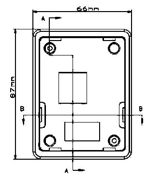
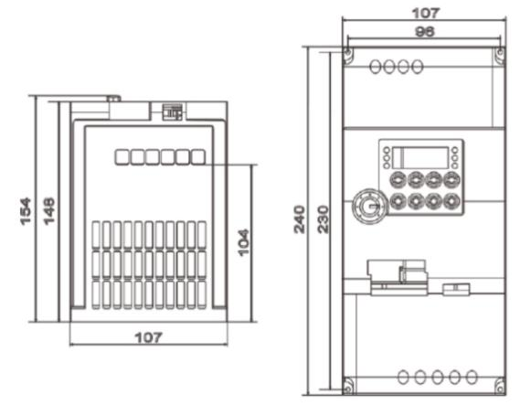
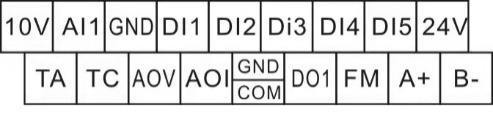

# Руководство пользователя частотного преобразователя серии CW100

**CTRL-DRIVE CW100 Series VFD English Manual V1.0**

Благодарим за приобретение преобразователя частоты (VFD).

Перед применением прочитайте и усвойте настоящее руководство и передайте его конечному пользователю.

Перед применением внимательно прочитайте **меры безопасности**.

Сохраните руководство для последующих консультаций. При возникновении вопросов обращайтесь в службу поддержки или техническую поддержку — специалисты окажут помощь.

Настоящее руководство содержит сведения о преобразователях частоты серии CW100, в том числе:

- сведения по безопасности и меры предосторожности;
- установку и проверку;
- инструкции по подключению;
- инструкции по эксплуатации;
- описание протокола связи;
- техническое обслуживание и поиск неисправностей.

Руководство предназначено для следующих специалистов:

- проектировщиков и специалистов по подбору оборудования;
- монтажников и специалистов по подключению;
- наладчиков;
- персонала технического обслуживания.

> Источник: [Scribd — CTRL-DRIVE CW100 Series VFD English Manual V1.0](https://ru.scribd.com/document/713397016/CTRL-DRIVE-CW100-Series-VFD-English-Manual-V1-0-Replicable4). Полный текст преобразован из идентичного 44-страничного PDF производителя: [CNCDrive VFD CW100 manual](https://shop.cncdrive.hu/cmproductsdownloader.php?field=document1&product=1265-cw-100-frekvenciavalto-4-kw-motorhoz-3-fazisu) (также публикуется как `https://cncdrive.com/downloads/VFD%20CW100_manual.pdf`).

---

## Содержание

- [Глава 1. Сведения по безопасности и меры предосторожности](#глава-1-сведения-по-безопасности-и-меры-предосторожности)
  - [1.1 Сведения по безопасности и меры предосторожности](#11-сведения-по-безопасности-и-меры-предосторожности)
  - [1.2 Меры предосторожности при эксплуатации](#12-меры-предосторожности-при-эксплуатации)
- [Глава 2. Сведения об изделии](#глава-2-сведения-об-изделии)
  - [2.1 Правила обозначения](#21-правила-обозначения)
  - [2.2 Технические характеристики](#22-технические-характеристики)
  - [2.3 Требования к условиям установки](#23-требования-к-условиям-установки)
- [Глава 3. Руководство по установке](#глава-3-руководство-по-установке)
  - [3.1 Габаритный чертёж изделия](#31-габаритный-чертёж-изделия)
  - [3.2 Чертёж установки изделия](#32-чертёж-установки-изделия)
- [Глава 4. Инструкции по подключению](#глава-4-инструкции-по-подключению)
  - [4.1 Описание интерфейсов и клемм](#41-описание-интерфейсов-и-клемм)
  - [4.2 Справочная схема подключения](#42-справочная-схема-подключения)
- [Глава 5. Панель управления](#глава-5-панель-управления)
  - [5.1 Внешний вид](#51-внешний-вид)
  - [5.2 Описание индикаторов](#52-описание-индикаторов)
  - [5.3 Описание клавиш панели управления](#53-описание-клавиш-панели-управления)
- [Глава 6. Таблица функциональных параметров](#глава-6-таблица-функциональных-параметров)
- [Глава 7. Техническое обслуживание и поиск неисправностей](#глава-7-техническое-обслуживание-и-поиск-неисправностей)
  - [7.1 Описание неисправностей](#71-описание-неисправностей)
  - [7.2 Перечень неисправностей](#72-перечень-неисправностей)
  - [7.3 Неисправности и способы устранения](#73-неисправности-и-способы-устранения)
  - [7.4 Характеристики тормозных резисторов](#74-характеристики-тормозных-резисторов)

---

## Глава 1. Сведения по безопасности и меры предосторожности

### 1.1 Сведения по безопасности и меры предосторожности

- Запрещается применять устройство вблизи воды, коррозионных газов, горючих газов, легковоспламеняющихся и взрывоопасных материалов — иначе возможны поражение электрическим током, возгорание или взрыв.
- Запрещается применять устройство в местах, где его использование ограничено или запрещено, иначе возможна авария.
- После отключения питания высокое напряжение в преобразователе сохраняется некоторое время. Не снимайте провод и не касайтесь клемм в течение 3 минут после отключения питания — иначе есть опасность поражения электрическим током.
- Надёжно заземлите клемму заземления преобразователя. В противном случае есть риск поражения электрическим током.
- Не касайтесь внутренних компонентов и цепей преобразователя частоты. В противном случае есть риск поражения электрическим током.
- Запрещается изменять внутренние детали или схемы преобразователя частоты.
- Данная серия преобразователей предназначена для управления обычными асинхронными двигателями и асинхронными двигателями для частотного регулирования, но не для однофазных двигателей и иных применений.
- Не применяйте повреждённый преобразователь — иначе возможна авария.
- Выберите безопасное место установки преобразователя: исключите прямое воздействие высокой температуры и солнечного света, избегайте сырости, попадания капель воды и различных масел, не допускайте попадания металлической пыли или стружки внутрь преобразователя.

### 1.2 Меры предосторожности при эксплуатации

- Подключение, установку и эксплуатацию должен выполнять специалист.
- Не выполняйте подключение при включённом питании — иначе возможно поражение электрическим током или травма персонала.
- Соблюдайте напряжение и полярность клемм, чтобы избежать повреждения оборудования или травмы персонала.
- Не прокладывайте силовые и сигнальные линии в одной трубе и не связывайте их вместе.
- Преобразователь частоты должен соответствовать асинхронному двигателю; обеспечьте хорошие условия теплоотвода.
- Не касайтесь радиатора и тормозного резистора преобразователя во время работы — иначе возможны ожоги.
- Не включайте и не выключайте питание часто; интервал желательно выдерживать более 1 минуты.
- Запрещается подключать сеть переменного тока к выходным клеммам U, V, W преобразователя частоты — иначе возможно внутреннее повреждение преобразователя.

---

## Глава 2. Сведения об изделии

После получения изделия внимательно проверьте следующее:

- соответствует ли тип преобразователя частоты заказанному;
- нет ли повреждений внешнего вида.

### 2.1 Правила обозначения

**Расшифровка номера модели**

Пример: `CW100-T2.2GB`

| Сегмент | Значение | Коды |
| --- | --- | --- |
| CW100 | Серия модели | CW100 |
| T | Уровень входа | **S** — 1 фаза 220 В; **T** — 3 фазы 380 В |
| 2.2GB | Номинальная мощность | **0.7GB** — 0,75 кВт; **1.5GB** — 1,5 кВт; **2.2GB** — 2,2 кВт; **4.0GB** — 4 кВт; **5.5GB** — 5,5 кВт; **7.5GB** — 7,5 кВт; **11.0GB** — 11 кВт |

### 2.2 Технические характеристики

| Модель | Мощность источника питания (кВА) | Входной ток (А) | Выходной ток (А) | Согласуемый двигатель (кВт) | Согласуемый двигатель (л. с.) |
| --- | ---: | ---: | ---: | ---: | ---: |
| **Однофазное питание: 220 В, 50 Гц / 60 Гц** | | | | | |
| CW100-0D75-1 | 1,5 | 8,2 | 4,0 | 0,75 | 1 |
| CW100-1D5-1 | 3,0 | 14,0 | 7,0 | 1,5 | 2 |
| CW100-2D2-1 | 4,0 | 23,0 | 9,6 | 2,2 | 3 |
| **Трёхфазное питание: 380 В, 50 Гц / 60 Гц** | | | | | |
| CW100-0D75-4 | 1,5 | 3,4 | 2,1 | 0,75 | 1 |
| CW100-1D5-4 | 3,0 | 5,0 | 3,8 | 1,5 | 2 |
| CW100-2D2-4 | 4,0 | 5,8 | 5,1 | 2,2 | 3 |
| CW100-4D0-4 | 5,9 | 10,5 | 9,0 | 4,0 | 5 |
| CW100-5D5-4 | 8,9 | 14,6 | 13,0 | 5,5 | 7,5 |
| CW100-7D5-4 | 11,0 | 20,5 | 17,0 | 7,5 | 10 |
| CW100-11D0-4 | 17,0 | 26,0 | 25,0 | 11,0 | 15 |

### 2.3 Требования к условиям установки

| Параметр | Требование |
| --- | --- |
| Степень защиты | IP20 |
| Высота установки | Максимум 1000 м (3280 фут) над уровнем моря. При превышении этого значения ток следует снижать на 1,2 % на каждые 10 м (328 фут) увеличения высоты. |
| Температура окружающей среды при работе | 0–40 °C (32–104 °F) |
| Температура при хранении | −20–55 °C (−4–131 °F) |
| Температура при транспортировке | −20–60 °C (−4–140 °F) |
| Влажность воздуха при работе | 5–85 %, без конденсации и обледенения |
| Влажность воздуха при хранении | 5–95 % |

---

## Глава 3. Руководство по установке

### 3.1 Габаритный чертёж изделия

Габаритный чертёж внешней панели. Размер монтажных отверстий: **82 × 61 мм**.

Контур внешней панели: **66 × 87 мм**, четыре монтажных отверстия по углам.

### 3.2 Чертёж установки изделия

#### CW100-0,75 кВт–2,2 кВт

Ориентировочные размеры по чертежу: ширина **85 мм**, высота **142 мм**, глубина около **110,5–116,35 мм** (включая ручку панели). Расстояние между монтажными отверстиями около **79 × 136 мм**.

#### CW100-4 кВт–5,5 кВт

Ориентировочные размеры по чертежу: ширина **95 мм**, высота **180 мм**, глубина около **96,5–120 мм**. Расстояние между монтажными отверстиями около **88,5 × 174 мм**.

#### CW100-7,5 кВт–11,0 кВт

Ориентировочные размеры по чертежу: ширина **107 мм**, высота **240 мм**, расстояние между монтажными отверстиями около **96 × 230 мм**.

---

## Глава 4. Инструкции по подключению

### 4.1 Описание интерфейсов и клемм

#### 4.1.1 Клеммы силовой цепи

**Таблица 4-1. Описание функций интерфейса и клемм**

| Клемма | Наименование | Описание функции |
| --- | --- | --- |
| R, S, T | Клемма ввода питания переменного тока | Подключение входного трёхфазного питания переменного тока. Для однофазного 220 В подключайте R и T. |
| P+, PB | Клемма тормозного резистора | Подключение тормозного резистора. |
| U, V, W | Выходная клемма | Подключение трёхфазного двигателя. |
| ⊕ | Клемма заземления | Соединение с землёй. |

#### 4.1.2 Клеммы цепи управления

**Таблица 4-2. Описание клемм цепи управления CW100**

| Группа | Клемма | Наименование | Описание функции |
| --- | --- | --- | --- |
| Питание | 10V–GND | Внешний источник 10 В | Выдаёт питание +10 В для внешнего устройства. Обычно питает внешний потенциометр сопротивлением 1–5 кОм. Максимальный выходной ток: 10 мА. |
| Питание | 24V–GND | Внешний источник 24 В | Выдаёт питание +24 В для внешнего устройства. Обычно питает клеммы DI/DO и внешние датчики. Максимальный выходной ток: 200 мА. |
| Аналоговый вход | AI1–GND | Аналоговый вход 1 | Диапазон входа: DC 0 В–10 В / 0 мА–20 мА, задаётся P4-39. Входное сопротивление: 22 кОм (напряжение), 500 Ом (ток). |
| Дискретный вход | DI1–GND | Дискретный вход 1 | Входное сопротивление: 1 кОм. |
| Дискретный вход | DI2–GND | Дискретный вход 2 | Диапазон напряжения для уровневого входа: 5–30 В. |
| Дискретный вход | DI3–GND | Дискретный вход 3 | Диапазон напряжения для уровневого входа: 5–30 В. |
| Дискретный вход | DI4–GND | Дискретный вход 4 | Диапазон напряжения для уровневого входа: 5–30 В. |
| Дискретный вход | DI5–GND | Вход высокоскоростного импульса | Помимо функций DI1–DI4 может использоваться как вход высокоскоростного импульса. Максимальная частота входа: 20 кГц. |
| Аналоговый выход | AOV–GND | Аналоговый выход | Диапазон выходного напряжения: 0–10 В. |
| Аналоговый выход | AOI–GND | Аналоговый выход | Диапазон выходного тока: 0–20 мА. |
| Дискретный выход | DO1–GND | Дискретный выход 1 | Оптоизоляция, двухполярный выход с открытым коллектором. Диапазон выходного напряжения: 0–24 В. Диапазон выходного тока: 0–50 мА. |
| Дискретный выход | FM–GND | Выход высокоскоростного импульса | Ограничивается F5-00 (выбор режима выхода клеммы FM). Как выход высокоскоростного импульса — максимальная частота до 20 кГц. Как выход с открытым коллектором — характеристики как у DO1. |
| Реле | TA–TC | Нормально разомкнутая клемма реле | Коммутационная способность контакта: 250 В перем. тока, 3 А, COSØ = 0,4; 30 В пост. тока, 1 А. |
| Связь | A+–B− | Клемма связи 485 | Входные и выходные сигнальные клеммы связи по протоколу MODBUS-RTU. |

### 4.2 Справочная схема подключения

Силовая часть и двигатель (верхняя часть преобразователя):

- **R, S, T** — вход трёхфазного питания 380 В (или однофазного 220 В на R и T).
- **P+, BR/PB** — тормозной резистор.
- **U, V, W** — двигатель **M**.
- Клеммы заземления корпуса и двигателя должны быть заземлены.

Клеммы управления (типовая раскладка на чертеже):

- **DI1–DI4** — многофункциональные дискретные входы 1–4.
- **DI5** — вход высокоскоростного импульса HDI.
- **+10V, AI1, AI2, GND** — опорное напряжение и аналоговые входы 0–10 В / 0–20 мА (AI1 показан с потенциометром).
- **A+, B−** — связь RS485.
- **AOV** — аналоговый выход по напряжению 0–10 В; **AOI** — аналоговый выход по току 0–20 мА.
- **FM, CME** — выход высокоскоростного импульса (оптопара).
- **DO1, GND** — выход с открытым коллектором (оптопара).
- **TA, TC** — релейный выход 1 (нормально разомкнутый).

---

## Глава 5. Панель управления

### 5.1 Внешний вид

### 5.2 Описание индикаторов

1. **RUN:** светится — преобразователь в состоянии работы; не светится — в состоянии останова.
2. **LOC:** указывает, управляется ли преобразователь с панели, с клемм или по связи.
3. **F/R:** светится — обратное вращение.
4. **Hz, A, V:** индикаторы единиц. Показывают текущую единицу отображения:
   - **Hz:** единица частоты;
   - **A:** единица тока;
   - **V:** единица напряжения;
   - **Hz + A:** единица частоты вращения;
   - **A + V:** проценты (%).

### 5.3 Описание клавиш панели управления

| Клавиша | Наименование | Функция |
| --- | --- | --- |
| PROG / PRG | Программирование | Вход в меню уровня I или выход из него. |
| M-FUN | Многофункциональный выбор | Переключение функции. Может быть задано как источник команды или как быстрое переключение направления согласно P7-01. |
| ▲ | Увеличение | Увеличение данных или кода функции. |
| ▼ | Уменьшение | Уменьшение данных или кода функции. |
| SHIFT | Сдвиг | Поочерёдный выбор отображаемых параметров в состоянии останова или работы и выбор разряда при изменении параметров. |
| ENTER | Подтверждение | Пошаговый вход в меню и подтверждение установки параметра. |
| RUN | Пуск | Пуск преобразователя в режиме управления с панели. |
| STOP / REST | Стоп | Останов преобразователя в состоянии работы и сброс в состоянии аварии. Функции этой клавиши ограничены параметром P7-02. |

---

## Глава 6. Таблица функциональных параметров

### 6.1 Краткое введение в коды функций

Если **PP-00** задан ненулевым числом, включена защита параметров. Для входа в меню необходимо ввести правильный пароль пользователя. Чтобы отменить защиту паролем, войдите с паролем и установите **PP-00** в 0.

> В печатном руководстве в этом предложении также встречается обозначение «FP-00»; в самой таблице кодов функций пароль пользователя — **PP-00**.

Группы **P** и **A** — стандартные функциональные параметры. Группа **U** — параметры мониторинга.

Обозначения в таблице кодов функций:

| Символ | Значение |
| --- | --- |
| ☆ | Параметр можно изменять как в состоянии останова, так и в состоянии работы. |
| ★ | Параметр нельзя изменять в состоянии работы. |
| ● | Параметр — фактически измеренное значение, изменять нельзя. |
| \* | Заводской параметр; задаётся только изготовителем. |

**Таблица 6-1. Стандартные функциональные параметры**

### P0 Стандартные функциональные параметры

| Код функции | Наименование параметра | Диапазон установки | По умолчанию | Свойство |
| --- | --- | --- | --- | --- |
| P0-01 | Режим управления двигателем | 0: Бездатчиковое векторное управление потоком (SFVC) 2: Управление V/F | 2 | ★ |
| P0-02 | Выбор источника команды | 0: Управление с панели (LED погашен) 1: Управление с клемм (LED горит) 2: Управление по связи (LED мигает) | 0 | ☆ |
| P0-03 | Выбор основного источника частоты X | 0: Цифровая установка (заданная частота P0-08, изменение UP/DOWN, не сохраняется при пропадании питания) 1: Цифровая установка (заданная частота P0-08, изменение UP/DOWN, сохраняется при пропадании питания) 2: AI1 3: AI2, местный потенциометр 4: Потенциометр панели / внешний потенциометр клавиатуры 5: Импульсная установка HDI (DI5) 6: Многоступенчатая команда 7: Простой PLC 8: PID 9: Установка по связи | 3 | ★ |
| P0-04 | Выбор вспомогательного источника частоты Y | То же, что P0-03 (выбор основного источника частоты X) | 0 | ★ |
| P0-05 | Выбор диапазона Y вспомогательного источника частоты при наложении | 0: Относительно максимальной частоты 1: Относительно основной частоты X | 0 | ☆ |
| P0-06 | Выбор диапазона Y вспомогательного источника частоты при наложении | 0% ～ 150% | 100% | ☆ |
| P0-07 | Выбор наложения источников частоты | Единицы (выбор источника частоты) 0: Основной источник частоты X 1: Операция X и Y (отношение задаётся десятками) 2: Переключение между X и Y 3: Переключение между X и «операцией X и Y» 4: Переключение между Y и «операцией X и Y» Десятки (отношение операции X и Y) 0: X+Y 1: X−Y 2: Максимум 3: Минимум | 00 | ☆ |
| P0-08 | Заданная частота | 0,00 Гц ～ максимальная частота (P0-10) | 50,00 Гц | ☆ |
| P0-09 | Направление вращения | 0: То же направление 1: Обратное направление | 0 | ☆ |
| P0-10 | Максимальная частота | 5,00 Гц ～ 500,00 Гц | 50,00 Гц | ★ |
| P0-11 | Источник верхнего предела частоты | 0: Задаётся P0-12 1: AI1 2: AI2, местный потенциометр 3: AI3, потенциометр панели / внешний потенциометр клавиатуры 4: Импульсная установка HDI 5: Установка по связи | 0 | ★ |
| P0-12 | Верхний предел частоты | От нижнего предела частоты (P0-14) до максимальной частоты (P0-10) | 50,00 Гц | ☆ |
| P0-13 | Смещение верхнего предела частоты | 0,00 Гц ～ максимальная частота P0-10 | 0,00 Гц | ☆ |
| P0-14 | Нижний предел частоты | 0,00 Гц ～ верхний предел частоты P0-12 | 0,00 Гц | ☆ |
| P0-15 | Несущая частота | 2,0 кГц ～ 8,0 кГц | Зависит от модели | ☆ |
| P0-16 | Коррекция несущей частоты по температуре | 0: Нет 1: Да | 1 | ☆ |
| P0-17 | Время разгона 1 | 0,00 с ～ 650,00 с (P0-19=2) 0,0 с ～ 6500,0 с (P0-19=1) 0 с ～ 65000 с (P0-19=0) | Зависит от модели | ☆ |
| P0-18 | Время торможения 1 | 0,00 с ～ 650,00 с (P0-19=2) 0,0 с ～ 6500,0 с (P0-19=1) 0 с ～ 65000 с (P0-19=0) | Зависит от модели | ☆ |
| P0-19 | Единица времени разгона/торможения | 0: 1 с 1: 0,1 с 2: 0,01 с | 1 | ★ |
| P0-21 | Смещение частоты вспомогательного источника для операции X и Y | 0,00 Гц ～ максимальная частота P0-10 | 0,00 Гц | ☆ |
| P0-22 | Разрешение задания частоты | 2: 0,01 Гц | 2 | ★ |
| P0-23 | Сохранение цифровой установки частоты при пропадании питания | 0: Не сохранять 1: Сохранять | 1 | ☆ |
| P0-25 | Базовая частота времени разгона/торможения | 0: Максимальная частота (P0-10) 1: Заданная частота 2: 100 Гц | 0 | ★ |
| P0-26 | Базовая частота для изменения UP/DOWN во время работы | 0: Рабочая частота 1: Заданная частота | 0 | ★ |
| P0-27 | Привязка источника команды к источнику частоты | Единицы (привязка команды панели к источнику частоты) 0: Без привязки 1: Источник частоты — цифровая установка 2: AI1 3: AI2 4: Потенциометр панели / внешний потенциометр клавиатуры 5: Импульсная установка HDI (DI5) 6: Многоступенчатая команда 7: Простой PLC 8: PID 9: Установка по связи Десятки (привязка клеммной команды к источнику частоты) Сотни (привязка команды связи к источнику частоты) | 0000 | ☆ |

### P1 Параметры двигателя

| Код функции | Наименование параметра | Диапазон установки | По умолчанию | Свойство |
| --- | --- | --- | --- | --- |
| P1-00 | Выбор типа двигателя | 0: Обычный асинхронный двигатель 2: Синхронный двигатель с постоянными магнитами | 0 | ★ |
| P1-01 | Номинальная мощность двигателя | 0,1 кВт ～ 1000,0 кВт | Зависит от модели | ★ |
| P1-02 | Номинальное напряжение двигателя | 1 В ～ 2000 В | Зависит от модели | ★ |
| P1-03 | Номинальный ток двигателя | 0,01 А ～ 10,00 А (мощность преобразователя ≤ 2,2 кВт) | Зависит от модели | ★ |
| P1-04 | Номинальная частота двигателя | 0,01 Гц ～ максимальная частота | Зависит от модели | ★ |
| P1-05 | Номинальная частота вращения двигателя | 1 об/мин ～ 65535 об/мин | Зависит от модели | ★ |
| P1-10 | Ток холостого хода (асинхронный двигатель) | 0,01 А ～ P1-03 | Зависит от модели | ★ |
| P1-37 | Выбор автонастройки | 0: Без автонастройки 1: Статическая автонастройка асинхронного двигателя 2: Полная автонастройка асинхронного двигателя | 0 | ★ |

### P2 Параметры векторного управления

| Код функции | Наименование параметра | Диапазон установки | По умолчанию | Свойство |
| --- | --- | --- | --- | --- |
| P2-00 | Пропорциональный коэффициент контура скорости 1 | 1 ～ 100 | 30 | ☆ |
| P2-01 | Постоянная интегрирования контура скорости 1 | 0,01 с ～ 10,00 с | 0,50 с | ☆ |
| P2-02 | Частота переключения 1 | 0,00 ～ P2-05 | 5,00 Гц | ☆ |
| P2-03 | Пропорциональный коэффициент контура скорости 2 | 1 ～ 100 | 20 | ☆ |
| P2-04 | Постоянная интегрирования контура скорости 2 | 0,01 с ～ 10,00 с | 1,00 с | ☆ |
| P2-05 | Частота переключения 2 | P2-02 ～ максимальная выходная частота | 10,00 Гц | ☆ |
| P2-06 | Коэффициент скольжения векторного управления | 50% ～ 200% | 100% | ☆ |
| P2-07 | Постоянная времени фильтра контура скорости | 0,000 с ～ 1,000 с | 0,050 с | ☆ |
| P2-09 | Источник верхнего предела момента в режиме управления скоростью | 0: Установка кода функции P2-10 1: AI1 2: AI2 3: Потенциометр панели / внешний потенциометр клавиатуры 4: Импульсная установка HDI 5: Установка по связи 6: MIN(AI1,AI2) 7: MAX(AI1,AI2) 1–7: полный диапазон вариантов соответствует P2-10 | 0 | ☆ |
| P2-10 | Цифровая установка верхнего предела момента в режиме управления скоростью | 0,0% ～ 200,0% | 150,0% | ☆ |
| P2-13 | Пропорциональный коэффициент регулирования возбуждения | 0 ～ 60000 | 2000 | ☆ |
| P2-14 | Интегральный коэффициент регулирования возбуждения | 0 ～ 60000 | 1300 | ☆ |
| P2-15 | Пропорциональный коэффициент регулирования момента | 0 ～ 60000 | 2000 | ☆ |
| P2-16 | Интегральный коэффициент регулирования момента | 0 ～ 60000 | 1300 | ☆ |
| P2-17 | Свойство интегрирования контура скорости | Единицы: разделение интегрирования 0: Запрещено 1: Разрешено | 0 | ☆ |
| P2-20 | Коэффициент максимального выходного напряжения | 100% ～ 110% | 105% | ★ |
| P2-21 | Коэффициент максимального момента в зоне ослабления поля | 50% ～ 200% | 100% | ☆ |

### P3 Параметры управления V/F

| Код функции | Наименование параметра | Диапазон установки | По умолчанию | Свойство |
| --- | --- | --- | --- | --- |
| P3-00 | Задание кривой VF | 0: Линейная V/F 1: Многоточечная V/F 2: Квадратичная V/F 3: V/F степени 1,2 4: V/F степени 1,4 6: V/F степени 1,6 8: V/F степени 1,8 9: Зарезервировано 10: Полное разделение V/F 11: Полуразделение V/F | 0 | ★ |
| P3-01 | Подъём момента | 0,0%: (автоматический подъём момента) 0,1% ～ 30,0% | Зависит от модели | ☆ |
| P3-02 | Частота отсечки подъёма момента | 0,00 Гц ～ максимальная частота | 50,00 Гц | ★ |
| P3-03 | Многоточечная V/F, частота 1 | 0,00 Гц ～ P3-05 | 0,00 Гц | ★ |
| P3-04 | Многоточечная V/F, напряжение 1 | 0,0% ～ 100,0% | 0,0% | ★ |
| P3-05 | Многоточечная V/F, частота 2 | P3-03 ～ P3-07 | 0,00 Гц | ★ |
| P3-06 | Многоточечная V/F, напряжение 2 | 0,0% ～ 100,0% | 0,0% | ★ |
| P3-07 | Многоточечная V/F, частота 3 | P3-05 ～ номинальная частота двигателя (P1-04) | 0,00 Гц | ★ |
| P3-08 | Многоточечная V/F, напряжение 3 | 0,0% ～ 100,0% | 0,0% | ★ |
| P3-09 | Коэффициент компенсации скольжения V/F | 0,0% ～ 200,0% | 0,0% | ☆ |
| P3-10 | Коэффициент перевозбуждения VF | 0 ～ 200 | 64 | ☆ |
| P3-11 | Коэффициент подавления колебаний VF | 0 ～ 100 | Зависит от модели | ☆ |

### P4 Входные клеммы

DI1–DI5 используют один и тот же список функций. Заводские значения: P4-00 = 1, P4-01 = 2, P4-02 = 4, P4-03 = 9, P4-04 = 12.

| Код функции | Наименование параметра | Диапазон установки | По умолчанию | Свойство |
| --- | --- | --- | --- | --- |
| P4-00 | Выбор функции клеммы DI1 | 0: Нет функции 1: Прямой RUN (FWD) или RUN 2: Обратный RUN (REV) или направление RUN 3: Трёхпроводное управление 4: Прямой JOG (FJOG) 5: Обратный JOG (RJOG) 6: Клемма UP 7: Клемма DOWN 8: Выбег (coast to stop) 9: Сброс аварии (RESET) 10: Пауза RUN 11: Нормально разомкнутый (NO) вход внешней аварии 12: Клемма многоступенчатого задания 1 13: Клемма многоступенчатого задания 2 14: Клемма многоступенчатого задания 3 15: Клемма многоступенчатого задания 4 16: Клемма 1 выбора времени разгона/торможения 17: Клемма 2 выбора времени разгона/торможения 18: Переключение источника частоты 19: Сброс установки UP и DOWN (клемма, панель) 20: Клемма 1 переключения источника команды 21: Запрет разгона/торможения 22: Пауза PID 23: Сброс состояния PLC 24: Пауза качания частоты 25: Вход счётчика 26: Сброс счётчика 27: Вход счёта длины 28: Сброс длины 29: Запрет управления моментом 30: Импульсный вход (только для DI5) 31: Зарезервировано 32: Немедленное торможение постоянным током 33: Нормально замкнутый (NC) вход внешней аварии 34: Разрешение изменения частоты 35: Обратное действие PID 36: Внешняя клемма STOP 1 37: Клемма 2 переключения источника команды 38: Пауза интегрирования PID 39: Переключение между основным источником частоты X и заданной частотой 40: Переключение между вспомогательным источником частоты Y и заданной частотой 41: Зарезервировано 42: Зарезервировано 43: Переключение параметров PID 44: Пользовательская авария 1 45: Пользовательская авария 2 46: Переключение управление скоростью / управление моментом 47: Аварийный останов 48: Внешняя клемма STOP 2 49: Торможение постоянным током при замедлении 50: Сброс текущего времени работы 51–59: Зарезервировано | 1 | ★ |
| P4-01 | Выбор функции клеммы DI2 | То же, что P4-00 | 2 | ★ |
| P4-02 | Выбор функции клеммы DI3 | То же, что P4-00 | 4 | ★ |
| P4-03 | Выбор функции клеммы DI4 | То же, что P4-00 | 9 | ★ |
| P4-04 | Выбор функции клеммы DI5 | То же, что P4-00 | 12 | ★ |
| P4-10 | Время фильтра DI | 0,000 с ～ 1,000 с | 0,01 с | ☆ |
| P4-11 | Режим клеммной команды | 0: Двухпроводный режим 1 1: Двухпроводный режим 2 2: Трёхпроводный режим 1 | 1 | ★ |
| P4-12 | Скорость клемм UP/DOWN | 0,001 Гц/с ～ 65,535 Гц/с | 1,00 Гц/с | ☆ |
| P4-13 | Минимальный вход кривой AI 1 | 0,00 В ～ P4-15 | 0,00 В | ☆ |
| P4-14 | Соответствующая установка минимального входа кривой AI 1 | −100,0% ～ +100,0% | 0,0% | ☆ |
| P4-15 | Максимальный вход кривой AI 1 | P4-13 ～ +10,00 В | 10,00 В | ☆ |
| P4-16 | Соответствующая установка максимального входа кривой AI 1 | −100,0% ～ +100,0% | 100,0% | ☆ |
| P4-17 | Время фильтра AI1 | 0,00 с ～ 10,00 с | 0,10 с | ☆ |
| P4-18 | Минимальный вход кривой AI 2 | 0,00 В ～ P4-20 | 0,00 В | ☆ |
| P4-19 | Соответствующая установка минимального входа кривой AI 2 | −100,0% ～ +100,0% | 0,0% | ☆ |
| P4-20 | Максимальный вход кривой AI 2 | P4-18 ～ +10,00 В | 10,00 В | ☆ |
| P4-21 | Соответствующая установка максимального входа кривой AI 2 | −100,0% ～ +100,0% | 100,0% | ☆ |
| P4-22 | Время фильтра AI2 | 0,00 с ～ 10,00 с | 0,10 с | ☆ |
| P4-23 | Минимальный вход кривой AI 3 | −10,00 В ～ P4-25 | −10,00 В | ☆ |
| P4-24 | Соответствующая установка минимального входа кривой AI 3 | −100,0% ～ +100,0% | −100,0% | ☆ |
| P4-25 | Максимальный вход кривой AI 3 | P4-23 ～ +10,00 В | 10,00 В | ☆ |
| P4-26 | Соответствующая установка максимального входа кривой AI 3 | −100,0% ～ +100,0% | 100,0% | ☆ |
| P4-27 | Время фильтра потенциометра панели | 0,00 с ～ 10,00 с | 0,10 с | ☆ |
| P4-28 | Минимальный вход импульса HDI | 0,00 кГц ～ P4-30 | 0,00 кГц | ☆ |
| P4-29 | Соответствующая установка минимального входа HDI | −100,0% ～ 100,0% | 0,0% | ☆ |
| P4-30 | Максимальный вход HDI | P4-28 ～ 100,00 кГц | 50,00 кГц | ☆ |
| P4-31 | Соответствующая установка максимального импульсного входа HDI | −100,0% ～ 100,0% | 100,0% | ☆ |
| P4-32 | Время фильтра HDI | 0,00 с ～ 10,00 с | 0,10 с | ☆ |
| P4-33 | Выбор кривой AI | Единицы (выбор кривой AI1) Кривая 1 (2 точки, см. P4-13–P4-16) Кривая 2 (2 точки, см. P4-18–P4-21) Кривая 3 (2 точки, см. P4-23–P4-26) Кривая 4 (4 точки, см. A6-00–A6-07) Кривая 5 (4 точки, см. A6-08–A6-15) Десятки (выбор кривой AI2): кривые 1–5 (как у AI1) Сотни (выбор кривой AI3): кривые 1–5 (как у AI1) | 321 | ☆ |
| P4-34 | Установка при AI меньше минимального входа | Единицы (для AI1 меньше минимума) 0: Минимальное значение 1: 0,0% Десятки (для AI2 меньше минимума): 0, 1 (как у AI1) Сотни (для AI3 меньше минимума): 0, 1 (как у AI1) | 000 | ☆ |
| P4-35 | Задержка DI1 | 0,0 с ～ 3600,0 с | 0,0 с | ★ |
| P4-36 | Задержка DI2 | 0,0 с ～ 3600,0 с | 0,0 с | ★ |
| P4-37 | Задержка DI3 | 0,0 с ～ 3600,0 с | 0,0 с | ★ |
| P4-38 | Выбор активного уровня DI | 0: Активен высокий уровень 1: Активен низкий уровень Единицы (режим DI1) Десятки (режим DI2) Сотни (режим DI3) Тысячи (режим DI4) Десятки тысяч (режим DI5) | 00000 | ★ |
| P4-39 | Выбор входа AI1: напряжение/ток | 0: Вход по напряжению 1: Вход по току | 0 | ★ |

### P5 Выходные клеммы

| Код функции | Наименование параметра | Диапазон установки | По умолчанию | Свойство |
| --- | --- | --- | --- | --- |
| P5-00 | Режим выхода клеммы FM | 0: Импульсный выход (FMP) 1: Выход переключающего сигнала (FMR) | 0 | ☆ |
| P5-01 | Выбор функции выхода FMR | 0: Нет выхода 1: Преобразователь работает 2: Выход аварии (останов) 3: Выход обнаружения уровня частоты FDT1 4: Частота достигнута 5: Работа на нулевой скорости (нет выхода при останове) 6: Предупреждение о перегрузке двигателя 7: Предупреждение о перегрузке преобразователя 8: Достигнуто заданное значение счётчика 9: Достигнуто назначенное значение счётчика 10: Длина достигнута 11: Цикл PLC завершён 12: Достигнуто накопленное время работы 13: Частота ограничена 14: Момент ограничен 15: Готовность к RUN 16: AI1 > AI2 17: Достигнут верхний предел частоты 18: Достигнут нижний предел частоты (связан с работой) 19: Выход состояния пониженного напряжения 20: Установка по связи 21: Зарезервировано 22: Зарезервировано 23: Работа на нулевой скорости 2 (есть выход при останове) 24: Достигнуто накопленное время включения 25: Выход обнаружения уровня частоты FDT2 26: Выход «частота 1 достигнута» 27: Выход «частота 2 достигнута» 28: Выход «ток 1 достигнут» 29: Выход «ток 2 достигнут» 30: Выход «время достигнуто» 31: Превышен предел входа AI1 32: Нагрузка стала 0 33: Обратное вращение 34: Состояние нулевого тока 35: Достигнута температура IGBT 36: Превышен предел тока 37: Достигнут нижний предел частоты (есть выход при останове) 38: Выход сигнализации 39: Предупреждение о перегреве двигателя 40: Достигнуто текущее время работы 41: Выход аварии (нет выхода, если это авария выбега и пониженного напряжения) | 2 | ☆ |
| P5-02 | Функция реле (T/A–T/C) | Тот же список, что у P5-01 | 0 | ☆ |
| P5-04 | Выбор функции выхода DO1 | Тот же список, что у P5-01 | 1 | ☆ |
| P5-06 | Выбор функции выхода FMP | 0: Рабочая частота 1: Заданная частота 2: Выходной ток 3: Выходной момент (абсолютное значение) 4: Выходная мощность 5: Выходное напряжение 6: Вход HDI (100,0% соответствует 100,0 кГц) 7: AI1 8: AI2 11: Значение счётчика 12: Установка по связи 13: Частота вращения двигателя 14: Выходной ток (100,0% соответствует 1000,0 А) 15: Выходное напряжение (100,0% соответствует 1000,0 В) 16: Выходной момент (фактическое значение) | 0 | ☆ |
| P5-08 | Выбор функции выхода AO1 | Тот же список, что у P5-06 | 0 | ☆ |
| P5-09 | Максимальная частота выхода FMP | 0,01 кГц ～ 100,00 кГц | 50,00 кГц | ☆ |
| P5-12 | Коэффициент смещения AO1 | −100,0% ～ +100,0% | 0,0% | ☆ |
| P5-13 | Коэффициент усиления AO1 | −10,00 ～ +10,00 | 1,00 | ☆ |
| P5-17 | Задержка выхода FMR | 0,0 с ～ 3600,0 с | 0,0 с | ☆ |
| P5-18 | Задержка выхода реле 1 | 0,0 с ～ 3600,0 с | 0,0 с | ☆ |
| P5-19 | Задержка выхода реле 2 | 0,0 с ～ 3600,0 с | 0,0 с | ☆ |
| P5-20 | Задержка выхода DO1 | 0,0 с ～ 3600,0 с | 0,0 с | ☆ |

### P6 Управление пуском/остановом

| Код функции | Наименование параметра | Диапазон установки | По умолчанию | Свойство |
| --- | --- | --- | --- | --- |
| P6-00 | Режим пуска | 0: Прямой пуск 1: Повторный пуск со слежением за частотой вращения 2: Пуск с предвозбуждением (асинхронный двигатель) | 0 | ☆ |
| P6-01 | Режим слежения за частотой вращения | 0: От частоты при останове 1: От частоты сети 2: От максимальной частоты | 0 | ★ |
| P6-02 | Скорость слежения за частотой вращения | 1 ～ 100 | 20 | ☆ |
| P6-03 | Частота пуска | 0,00 Гц ～ 10,00 Гц | 0,00 Гц | ☆ |
| P6-04 | Время удержания частоты пуска | 0,0 с ～ 100,0 с | 0,0 с | ★ |
| P6-05 | Ток торможения постоянным током при пуске / ток предвозбуждения | 0% ～ 100% | 0% | ★ |
| P6-06 | Время торможения постоянным током при пуске / время предвозбуждения | 0,0 с ～ 100,0 с | 0,0 с | ★ |
| P6-07 | Режим разгона/торможения | 0: Линейный разгон/торможение 1: Статическая S-кривая 2: Динамическая S-кривая | 0 | ★ |
| P6-08 | Доля времени начального участка S-кривой | 0,0% ～ (100% − P6-09) | 30,0% | ★ |
| P6-09 | Доля времени конечного участка S-кривой | 0,0% ～ (100% − P6-08) | 30,0% | ★ |
| P6-10 | Режим останова | 0: Останов с замедлением 1: Выбег | 0 | ☆ |
| P6-11 | Начальная частота торможения постоянным током при останове | 0,00 Гц ～ максимальная частота | 0,00 Гц | ☆ |
| P6-12 | Время ожидания торможения постоянным током при останове | 0,0 с ～ 100,0 с | 0,0 с | ☆ |
| P6-13 | Ток торможения постоянным током при останове | 0% ～ 100% | 0% | ☆ |
| P6-14 | Время торможения постоянным током при останове | 0,0 с ～ 100,0 с | 0,0 с | ☆ |
| P6-15 | Коэффициент использования тормоза | 0% ～ 100% | 100% | ☆ |

### P7 Панель управления и индикация

| Код функции | Наименование параметра | Диапазон установки | По умолчанию | Свойство |
| --- | --- | --- | --- | --- |
| P7-01 | Выбор функции клавиши MF.K | 0: Клавиша MF.K отключена 1: Переключение между управлением с панели и дистанционным управлением (клеммы или связь) 2: Переключение прямого и обратного вращения 3: Прямой JOG 4: Обратный JOG | 0 | ★ |
| P7-02 | Функция клавиши STOP/RESET | 0: STOP/RESET действует только при управлении с панели 1: STOP/RESET действует в любом режиме управления | 1 | ☆ |
| P7-03 | Параметры индикации LED при работе 1 | 0000–FFFF Bit00: Рабочая частота 1 (Гц) Bit01: Заданная частота (Гц) Bit02: Напряжение шины (В) Bit03: Выходное напряжение (В) Bit04: Выходной ток (А) Bit05: Выходная мощность (кВт) Bit06: Выходной момент (%) Bit07: Состояние входов DI Bit08: Состояние выходов DO Bit09: Напряжение AI1 (В) Bit10: Напряжение AI2 (В) Bit11: Напряжение потенциометра панели (В) Bit12: Значение счётчика Bit13: Значение длины Bit14: Индикация скорости нагрузки Bit15: Задание PID | 1F | ☆ |
| P7-04 | Параметры индикации LED при работе 2 | 0000–FFFF Bit00: Обратная связь PID Bit01: Ступень PLC Bit02: Заданная частота HDI (кГц) Bit03: Рабочая частота 2 (Гц) Bit04: Оставшееся время работы Bit05: Напряжение AI1 до коррекции (В) Bit06: AI2 Bit07: Напряжение потенциометра панели до коррекции (В) Bit08: Линейная скорость Bit09: Текущее время включения (ч) Bit10: Текущее время работы (мин) Bit11: Заданная частота HDI (Гц) Bit12: Значение установки по связи Bit13: Скорость обратной связи энкодера (Гц) Bit14: Индикация основной частоты X (Гц) Bit15: Индикация вспомогательной частоты Y (Гц) | 0 | ☆ |
| P7-05 | Параметры индикации LED при останове | 0000–FFFF Bit00: Заданная частота (Гц) Bit01: Напряжение шины (В) Bit02: Состояние входов DI Bit03: Состояние выходов DO Bit04: Напряжение AI1 (В) Bit05: Напряжение AI2 (В) Bit06: Напряжение потенциометра (В) Bit07: Значение счётчика Bit08: Значение длины Bit09: Ступень PLC Bit10: Скорость нагрузки Bit11: Задание PID Bit12: Заданная частота HDI (кГц) | 33 | ☆ |
| P7-06 | Коэффициент индикации скорости нагрузки | 0,0001 ～ 6,5000 | 1,0000 | ☆ |
| P7-07 | Температура радиатора IGBT преобразователя | 0 °C ～ 120 °C | — | ● |
| P7-09 | Накопленное время работы | 0 ч ～ 65535 ч | — | ● |
| P7-12 | Число десятичных знаков индикации скорости нагрузки | Единицы: число знаков U0-14 0: 0 знаков 1: 1 знак 2: 2 знака 3: 3 знака Десятки: число знаков U0-19 / U0-29 0: 0 знаков 1: 1 знак | 21 | ☆ |
| P7-13 | Накопленное время включения | 0 ～ 65535 ч | — | ● |
| P7-14 | Накопленное потребление энергии | 0 ～ 65535 кВт·ч | — | ● |

### P8 Вспомогательные функции

| Код функции | Наименование параметра | Диапазон установки | По умолчанию | Свойство |
| --- | --- | --- | --- | --- |
| P8-00 | Частота работы JOG | 0,00 Гц ～ максимальная частота | 2,00 Гц | ☆ |
| P8-01 | Время разгона JOG | 0,0 с ～ 6500,0 с | 20,0 с | ☆ |
| P8-02 | Время торможения JOG | 0,0 с ～ 6500,0 с | 20,0 с | ☆ |
| P8-03 | Время разгона 2 | 0,0 с ～ 6500,0 с | Зависит от модели | ☆ |
| P8-04 | Время торможения 2 | 0,0 с ～ 6500,0 с | Зависит от модели | ☆ |
| P8-05 | Время разгона 3 | 0,0 с ～ 6500,0 с | Зависит от модели | ☆ |
| P8-06 | Время торможения 3 | 0,0 с ～ 6500,0 с | Зависит от модели | ☆ |
| P8-07 | Время разгона 4 | 0,0 с ～ 6500,0 с | Зависит от модели | ☆ |
| P8-08 | Время торможения 4 | 0,0 с ～ 6500,0 с | Зависит от модели | ☆ |
| P8-09 | Частота пропуска 1 | 0,00 Гц ～ максимальная частота | 0,00 Гц | ☆ |
| P8-10 | Частота пропуска 2 | 0,00 Гц ～ максимальная частота | 0,00 Гц | ☆ |
| P8-11 | Амплитуда пропуска частоты | 0,00 Гц ～ максимальная частота | 0,01 Гц | ☆ |
| P8-12 | Мёртвая зона прямого/обратного вращения | 0,0 с ～ 3000,0 с | 0,0 с | ☆ |
| P8-13 | Управление реверсом | 0: Разрешено 1: Запрещено | 0 | ☆ |
| P8-14 | Режим работы, когда заданная частота ниже нижнего предела частоты | 0: Работа на нижнем пределе частоты 1: Останов 2: Работа на нулевой скорости | 0 | ☆ |
| P8-15 | Droop-управление | 0,00 Гц ～ 10,00 Гц | 0,00 Гц | ☆ |
| P8-16 | Порог накопленного времени включения | 0 ч ～ 65000 ч | 0 ч | ☆ |
| P8-17 | Порог накопленного времени работы | 0 ч ～ 65000 ч | 0 ч | ☆ |
| P8-18 | Защита при пуске | 0: Нет 1: Да | 0 | ☆ |
| P8-19 | Значение обнаружения частоты (FDT1) | 0,00 Гц ～ максимальная частота | 50,00 Гц | ☆ |
| P8-20 | Гистерезис обнаружения частоты (гистерезис FDT 1) | 0,0% ～ 100,0% (электрический уровень FDT1) | 5,0% | ☆ |
| P8-21 | Диапазон обнаружения достижения частоты | 0,0% ～ 100,0% (максимальная частота) | 0,0% | ☆ |
| P8-25 | Точка переключения частоты между временем разгона 1 и 2 | 0,00 Гц ～ максимальная частота | 0,00 Гц | ☆ |
| P8-26 | Точка переключения частоты между временем торможения 1 и 2 | 0,00 Гц ～ максимальная частота | 0,00 Гц | ☆ |
| P8-27 | Приоритет клеммного JOG | 0: Запрещён 1: Разрешён | 0 | ☆ |
| P8-28 | Значение обнаружения частоты (FDT2) | 0,00 Гц ～ максимальная частота | 50,00 Гц | ☆ |
| P8-29 | Гистерезис обнаружения частоты (гистерезис FDT 2) | 0,0% ～ 100,0% (электрический уровень FDT2) | 5,0% | ☆ |
| P8-30 | Значение обнаружения достижения любой частоты 1 | 0,00 Гц ～ максимальная частота | 50,00 Гц | ☆ |
| P8-31 | Амплитуда обнаружения достижения любой частоты 1 | 0,0% ～ 100,0% (максимальная частота) | 0,0% | ☆ |
| P8-32 | Значение обнаружения достижения любой частоты 2 | 0,00 Гц ～ максимальная частота | 50,00 Гц | ☆ |
| P8-33 | Амплитуда обнаружения достижения любой частоты 2 | 0,0% ～ 100,0% (максимальная частота) | 5,0% | ☆ |
| P8-34 | Уровень обнаружения нулевого тока | 0,0% ～ 300,0% номинального тока двигателя | 5,0% | ☆ |
| P8-35 | Задержка обнаружения нулевого тока | 0,01 с ～ 600,00 с | 0,10 с | ☆ |
| P8-36 | Порог выходного сверхтока | 0,0% (без обнаружения) 0,1%–300,0% (номинальный ток двигателя) | 200,0% | ☆ |
| P8-37 | Задержка обнаружения выходного сверхтока | 0,00 с ～ 600,00 с | 0,00 с | ☆ |
| P8-38 | Достижение любого тока 1 | 0,0%–300,0% (номинальный ток двигателя) | 100,0% | ☆ |
| P8-39 | Амплитуда достижения любого тока 1 | 0,0% ～ 300,0% (номинальный ток двигателя) | 0,0% | ☆ |
| P8-40 | Достижение любого тока 2 | 0,0% ～ 300,0% (номинальный ток двигателя) | 100,0% | ☆ |
| P8-41 | Амплитуда достижения любого тока 2 | 0,0% ～ 300,0% (номинальный ток двигателя) | 0,0% | ☆ |
| P8-42 | Функция таймера | 0: Запрещена 1: Разрешена | 0 | ☆ |
| P8-43 | Источник длительности таймера | 0: P8-44 1: AI1 2: AI2 3: Потенциометр панели (аналоговый вход соответствует значению P8-44 / в оригинале также F8-44) | 0 | ☆ |
| P8-44 | Длительность таймера | 0,0 мин ～ 6500,0 мин | 0,0 мин | ☆ |
| P8-45 | Нижний предел напряжения входа AI1 | 0,00 В ～ P8-46 | 3,10 В | ☆ |
| P8-46 | Верхний предел напряжения входа AI1 | P8-45 ～ 10,00 В | 6,80 В | ☆ |
| P8-47 | Порог температуры IGBT | 0 °C ～ 100 °C | 75 °C | ☆ |
| P8-49 | Частота пробуждения | Частота сна (P8-51) ～ максимальная частота (P0-10) | 0,00 Гц | ☆ |
| P8-50 | Задержка пробуждения | 0,0 с ～ 6500,0 с | 0,0 с | ☆ |
| P8-51 | Частота сна | 0,00 Гц ～ частота пробуждения (P8-49) | 0,00 Гц | ☆ |
| P8-52 | Задержка сна | 0,0 с ～ 6500,0 с | 0,0 с | ☆ |
| P8-53 | Достигнуто текущее время работы | 0,0 ～ 6500,0 мин | 0,0 мин | ☆ |
| P8-54 | Коэффициент коррекции выходной мощности | 0,00% ～ 200,0% | 100,0% | ☆ |

### P9 Аварии и защита

| Код функции | Наименование параметра | Диапазон установки | По умолчанию | Свойство |
| --- | --- | --- | --- | --- |
| P9-00 | Выбор защиты от перегрузки двигателя | 0: Запрещена 1: Разрешена | 1 | ● |
| P9-01 | Коэффициент защиты от перегрузки двигателя | 0,20 ～ 10,00 | 1,00 | ● |
| P9-02 | Коэффициент предупреждения о перегрузке двигателя | 50% ～ 100% | 80% | ● |
| P9-03 | Коэффициент стопора по перенапряжению | 0 ～ 100 | 0 | ● |
| P9-04 | Защитное напряжение стопора по перенапряжению | 650 ～ 780 В | 760 В | ● |
| P9-05 | Коэффициент стопора по сверхтоку | 0 ～ 100 | 20 | ● |
| P9-06 | Защитный ток стопора по сверхтоку | 100% ～ 200% | 150% | ● |
| P9-07 | КЗ на землю при включении питания | 0: Запрещено 1: Разрешено | 1 | ● |
| P9-08 | Напряжение начала работы тормозного модуля | 700 ～ 800 В | 750 В | ● |
| P9-09 | Число автосбросов аварии | 0 ～ 20 | 0 | ● |
| P9-10 | Действие DO при автосбросе аварии | 0: Не действует 1: Действует | 0 | ● |
| P9-11 | Интервал автосброса аварии | 0,1 с ～ 100,0 с | 1,0 с | ● |
| P9-12 | Выбор защиты от обрыва входной фазы / защиты включения контактора | Единицы: защита от обрыва входной фазы Десятки: защита включения контактора 0: Запрещена 1: Разрешена | 11 | ● |
| P9-13 | Выбор защиты от обрыва выходной фазы | 0: Запрещена 1: Разрешена | 1 | ● |
| P9-14 | Тип 1-й аварии | 0: Нет аварии 1: Зарезервировано 2: Сверхток при разгоне 3: Сверхток при торможении 4: Сверхток на постоянной скорости 5: Перенапряжение при разгоне 6: Перенапряжение при торможении 7: Перенапряжение на постоянной скорости 8: Перегрузка буферного резистора 9: Пониженное напряжение 10: Перегрузка преобразователя 11: Перегрузка двигателя 12: Обрыв фазы на входе питания 13: Обрыв фазы на выходе питания 14: Перегрев IGBT 15: Авария внешнего оборудования 16: Авария связи 17: Авария контактора 18: Авария измерения тока 19: Авария автонастройки двигателя 21: Авария чтения-записи EEPROM 22: Аппаратная авария преобразователя 23: Короткое замыкание на землю 24: Зарезервировано 25: Зарезервировано 26: Достигнуто накопленное время работы 27: Пользовательская авария 1 28: Пользовательская авария 2 29: Достигнуто накопленное время включения 30: Нагрузка стала 0 31: Потеря обратной связи PID во время работы 40: Авария ограничения тока 41: Авария переключения двигателя во время работы 42: Слишком большое отклонение скорости 43: Превышение скорости двигателя | — | ● |
| P9-15 | Тип 2-й аварии | Тот же список, что у P9-14 | — | ● |
| P9-16 | Тип 3-й (последней) аварии | Тот же список, что у P9-14 | — | ● |
| P9-17 | Частота при 3-й аварии | — | — | ● |
| P9-18 | Ток при 3-й аварии | — | — | ● |
| P9-19 | Напряжение шины при 3-й аварии | — | — | ● |
| P9-20 | Состояние входных клемм при 3-й аварии | — | — | ● |
| P9-21 | Состояние выходных клемм при 3-й аварии | — | — | ● |
| P9-22 | Состояние преобразователя при 3-й аварии | — | — | ● |
| P9-23 | Время включения при 3-й аварии | — | — | ● |
| P9-24 | Время работы при 3-й аварии | — | — | ● |
| P9-27 | Частота при 2-й аварии | — | — | ● |
| P9-28 | Ток при 2-й аварии | — | — | ● |
| P9-29 | Напряжение шины при 2-й аварии | — | — | ● |
| P9-30 | Состояние входных клемм при 2-й аварии | — | — | ● |
| P9-31 | Состояние выходных клемм при 2-й аварии | — | — | ● |
| P9-32 | Состояние преобразователя при 2-й аварии | — | — | ● |
| P9-33 | Время включения при 2-й аварии | — | — | ● |
| P9-34 | Время работы при 2-й аварии | — | — | ● |
| P9-37 | Частота при 1-й аварии | — | — | ● |
| P9-38 | Ток при 1-й аварии | — | — | ● |
| P9-39 | Напряжение шины при 1-й аварии | — | — | ● |
| P9-40 | Состояние входных клемм при 1-й аварии | — | — | ● |
| P9-41 | Состояние выходных клемм при 1-й аварии | — | — | ● |
| P9-42 | Состояние преобразователя при 1-й аварии | — | — | ● |
| P9-43 | Время включения при 1-й аварии | — | — | ● |
| P9-44 | Время работы при 1-й аварии | — | — | ● |
| P9-47 | Выбор действия защиты при аварии 1 | Единицы (перегрузка двигателя, 11) 0: Выбег 1: Останов согласно режиму останова 2: Продолжить работу Десятки (обрыв фазы на входе, 12) Сотни (обрыв фазы на выходе, 13) Тысячи (авария внешнего оборудования, 15) Десятки тысяч (авария связи, 16) | 00000 | ☆ |
| P9-54 | Выбор частоты для продолжения работы при аварии | 0: Текущая рабочая частота 1: Заданная частота 2: Верхний предел частоты 3: Нижний предел частоты 4: Резервная частота при аномалии | 00000 | ☆ |
| P9-55 | Резервная частота при аномалии | 0,0% ～ 100,0% (100,0% соответствует максимальной частоте P0-10) | 100,0% | ☆ |
| P9-59 | Выбор действия при мгновенном пропадании питания | 0: Недействительно 1: Управление постоянством напряжения шины 2: Останов с замедлением | 0 | ★ |
| P9-60 | Напряжение паузы действия при мгновенном пропадании питания | 80% ～ 100,0% | 85,0% | ★ |
| P9-61 | Время оценки восстановления напряжения при мгновенном пропадании питания | 0,5 с | 0,5 с | ★ |
| P9-62 | Напряжение шины для оценки действия при мгновенном пропадании питания | 80% ～ 100,0% | 80,0% | ★ |
| P9-63 | Защита при нагрузке, ставшей 0 | 0: Запрещена 1: Разрешена | 0 | ☆ |
| P9-64 | Уровень обнаружения нагрузки, ставшей 0 | 0,0 ～ 100,0% | 10,0% | ☆ |
| P9-65 | Время обнаружения нагрузки, ставшей 0 | 0,0 ～ 60,0 с | 1,0 с | ☆ |

### PA Функция PID

| Код функции | Наименование параметра | Диапазон установки | По умолчанию | Свойство |
| --- | --- | --- | --- | --- |
| PA-00 | Источник задания PID | 0: PA-01 1: AI1 2: AI2 3: Потенциометр панели 4: Импульсная установка HDI (DI5) 5: Установка по связи 6: Многоступенчатое задание | 0 | ☆ |
| PA-01 | Цифровое задание PID | 0,0% ～ 100,0% | 50,0% | ☆ |
| PA-02 | Источник обратной связи PID | 0: AI1 1: AI2 2: Потенциометр панели 3: AI1 − AI2 4: Импульсная установка HDI (DI5) 5: Установка по связи 6: AI1 + AI2 7: MAX (|AI1|, |AI2|) 8: MIN (|AI1|, |AI2|) | 0 | ☆ |
| PA-03 | Направление действия PID | 0: Прямое действие 1: Обратное действие | 0 | ☆ |
| PA-04 | Диапазон задания/обратной связи PID | 0 ～ 65535 | 1000 | ☆ |
| PA-05 | Пропорциональный коэффициент Kp1 | 0,0 ～ 100,0 | 20,0 | ☆ |
| PA-06 | Время интегрирования Ti1 | 0,01 с ～ 10,00 с | 2,00 с | ☆ |
| PA-07 | Время дифференцирования Td1 | 0,000 с ～ 10,000 с | 0,000 с | ☆ |
| PA-08 | Частота отсечки обратного вращения PID | 0,00 ～ максимальная частота | 2,00 Гц | ☆ |
| PA-09 | Предел отклонения PID | 0,0% ～ 100,0% | 0,0% | ☆ |
| PA-10 | Предел дифференцирования PID | 0,00% ～ 100,00% | 0,10% | ☆ |
| PA-11 | Время изменения задания PID | 0,00 ～ 650,00 с | 0,00 с | ☆ |
| PA-12 | Время фильтра обратной связи PID | 0,00 ～ 60,00 с | 0,00 с | ☆ |
| PA-13 | Время фильтра выхода PID | 0,00 ～ 60,00 с | 0,00 с | ☆ |
| PA-15 | Пропорциональный коэффициент Kp2 | 0,0 ～ 100,0 | 20,0 | ☆ |
| PA-16 | Время интегрирования Ti2 | 0,01 с ～ 10,00 с | 2,00 с | ☆ |
| PA-17 | Время дифференцирования Td2 | 0,000 с ～ 10,000 с | 0,000 с | ☆ |
| PA-18 | Условие переключения параметров PID | 0: Без переключения 1: Переключение через DI 2: Автоматическое переключение по отклонению 3: Автоматическое переключение по рабочей частоте | 0 | ☆ |
| PA-19 | Отклонение переключения параметров PID 1 | 0,0% ～ PA-20 | 20,0% | ☆ |
| PA-20 | Отклонение переключения параметров PID 2 | PA-19 ～ 100,0% | 80,0% | ☆ |
| PA-21 | Начальное значение PID | 0,0% ～ 100,0% | 0,0% | ☆ |
| PA-22 | Время удержания начального значения PID | 0,00 ～ 650,00 с | 0,00 с | ☆ |
| PA-23 | Максимальное отклонение между двумя выходами PID в прямом направлении | 0,00% ～ 100,00% | 1,00% | ☆ |
| PA-24 | Максимальное отклонение между двумя выходами PID в обратном направлении | 0,00% ～ 100,00% | 1,00% | ☆ |
| PA-25 | Свойство интегрирования PID | Единицы (раздельное интегрирование) 0: Недействительно 1: Действительно Десятки (останавливать ли интегрирование при достижении предела выхода) 0: Продолжать интегрирование 1: Остановить интегрирование | 00 | ☆ |
| PA-26 | Значение обнаружения потери обратной связи PID | 0,0%: не оценивать потерю обратной связи 0,1%–100,0% | 0,0% | ☆ |
| PA-27 | Время обнаружения потери обратной связи PID | 0,0 с ～ 20,0 с | 0,0 с | ☆ |
| PA-28 | Работа PID при останове | 0: Нет работы PID при останове 1: Работа PID при останове | 0 | ☆ |

### PB Качание частоты, фиксированная длина и счёт

| Код функции | Наименование параметра | Диапазон установки | По умолчанию | Свойство |
| --- | --- | --- | --- | --- |
| PB-00 | Режим задания качания частоты | 0: Относительно центральной частоты 1: Относительно максимальной частоты | 0 | ☆ |
| PB-01 | Амплитуда качания частоты | 0,0% ～ 100,0% | 0,0% | ☆ |
| PB-02 | Амплитуда частоты пропуска | 0,0% ～ 50,0% | 0,0% | ☆ |
| PB-03 | Цикл качания частоты | 0,1 с ～ 3000,0 с | 10,0 с | ☆ |
| PB-04 | Коэффициент времени нарастания треугольной волны | 0,1% ～ 100,0% | 50,0% | ☆ |
| PB-05 | Заданная длина | 0 м ～ 65535 м | 1000 м | ☆ |
| PB-06 | Фактическая длина | 0 м ～ 65535 м | 0 м | ☆ |
| PB-07 | Число импульсов на метр | 0,1 ～ 6553,5 | 100,0 | ☆ |
| PB-08 | Заданное значение счётчика | 1 ～ 65535 | 1000 | ☆ |
| PB-09 | Назначенное значение счётчика | 1 ～ 65535 | 1000 | ☆ |

### PC Многоступенчатое задание и простой PLC

| Код функции | Наименование параметра | Диапазон установки | По умолчанию | Свойство |
| --- | --- | --- | --- | --- |
| PC-00 | Задание 0 | −100,0% ～ 100,0% | 0,0% | ☆ |
| PC-01 | Задание 1 | −100,0% ～ 100,0% | 0,0% | ☆ |
| PC-02 | Задание 2 | −100,0% ～ 100,0% | 0,0% | ☆ |
| PC-03 | Задание 3 | −100,0% ～ 100,0% | 0,0% | ☆ |
| PC-04 | Задание 4 | −100,0% ～ 100,0% | 0,0% | ☆ |
| PC-05 | Задание 5 | −100,0% ～ 100,0% | 0,0% | ☆ |
| PC-06 | Задание 6 | −100,0% ～ 100,0% | 0,0% | ☆ |
| PC-07 | Задание 7 | −100,0% ～ 100,0% | 0,0% | ☆ |
| PC-08 | Задание 8 | −100,0% ～ 100,0% | 0,0% | ☆ |
| PC-09 | Задание 9 | −100,0% ～ 100,0% | 0,0% | ☆ |
| PC-10 | Задание 10 | −100,0% ～ 100,0% | 0,0% | ☆ |
| PC-11 | Задание 11 | −100,0% ～ 100,0% | 0,0% | ☆ |
| PC-12 | Задание 12 | −100,0% ～ 100,0% | 0,0% | ☆ |
| PC-13 | Задание 13 | −100,0% ～ 100,0% | 0,0% | ☆ |
| PC-14 | Задание 14 | −100,0% ～ 100,0% | 0,0% | ☆ |
| PC-15 | Задание 15 | −100,0% ～ 100,0% | 0,0% | ☆ |
| PC-16 | Режим работы простого PLC | 0: Останов после одного цикла 1: Сохранить конечные значения после одного цикла 2: Повторять после одного цикла | 0 | ☆ |
| PC-17 | Выбор сохранения простого PLC | Единицы (сохранение при пропадании питания) 0: Нет 1: Да Десятки (сохранение при останове) 0: Нет 1: Да | 00 | ☆ |
| PC-18 | Время работы простого PLC, задание 0 | 0,0 с(ч) ～ 6553,5 с(ч) | 0,0 с(ч) | ☆ |
| PC-19 | Время разгона/торможения простого PLC, задание 0 | 0 ～ 3 | 0 | ☆ |
| PC-20 | Время работы простого PLC, задание 1 | 0,0 с(ч) ～ 6553,5 с(ч) | 0,0 с(ч) | ☆ |
| PC-21 | Время разгона/торможения простого PLC, задание 1 | 0 ～ 3 | 0 | ☆ |
| PC-22 | Время работы простого PLC, задание 2 | 0,0 с(ч) ～ 6553,5 с(ч) | 0,0 с(ч) | ☆ |
| PC-23 | Время разгона/торможения простого PLC, задание 2 | 0 ～ 3 | 0 | ☆ |
| PC-24 | Время работы простого PLC, задание 3 | 0,0 с(ч) ～ 6553,5 с(ч) | 0,0 с(ч) | ☆ |
| PC-25 | Время разгона/торможения простого PLC, задание 3 | 0 ～ 3 | 0 | ☆ |
| PC-26 | Время работы простого PLC, задание 4 | 0,0 с(ч) ～ 6553,5 с(ч) | 0,0 с(ч) | ☆ |
| PC-27 | Время разгона/торможения простого PLC, задание 4 | 0 ～ 3 | 0 | ☆ |
| PC-28 | Время работы простого PLC, задание 5 | 0,0 с(ч) ～ 6553,5 с(ч) | 0,0 с(ч) | ☆ |
| PC-29 | Время разгона/торможения простого PLC, задание 5 | 0 ～ 3 | 0 | ☆ |
| PC-30 | Время работы простого PLC, задание 6 | 0,0 с(ч) ～ 6553,5 с(ч) | 0,0 с(ч) | ☆ |
| PC-31 | Время разгона/торможения простого PLC, задание 6 | 0 ～ 3 | 0 | ☆ |
| PC-32 | Время работы простого PLC, задание 7 | 0,0 с(ч) ～ 6553,5 с(ч) | 0,0 с(ч) | ☆ |
| PC-33 | Время разгона/торможения простого PLC, задание 7 | 0 ～ 3 | 0 | ☆ |
| PC-34 | Время работы простого PLC, задание 8 | 0,0 с(ч) ～ 6553,5 с(ч) | 0,0 с(ч) | ☆ |
| PC-35 | Время разгона/торможения простого PLC, задание 8 | 0 ～ 3 | 0 | ☆ |
| PC-36 | Время работы простого PLC, задание 9 | 0,0 с(ч) ～ 6553,5 с(ч) | 0,0 с(ч) | ☆ |
| PC-37 | Время разгона/торможения простого PLC, задание 9 | 0 ～ 3 | 0 | ☆ |
| PC-38 | Время работы простого PLC, задание 10 | 0,0 с(ч) ～ 6553,5 с(ч) | 0,0 с(ч) | ☆ |
| PC-39 | Время разгона/торможения простого PLC, задание 10 | 0 ～ 3 | 0 | ☆ |
| PC-40 | Время работы простого PLC, задание 11 | 0,0 с(ч) ～ 6553,5 с(ч) | 0,0 с(ч) | ☆ |
| PC-41 | Время разгона/торможения простого PLC, задание 11 | 0 ～ 3 | 0 | ☆ |
| PC-42 | Время работы простого PLC, задание 12 | 0,0 с(ч) ～ 6553,5 с(ч) | 0,0 с(ч) | ☆ |
| PC-43 | Время разгона/торможения простого PLC, задание 12 | 0 ～ 3 | 0 | ☆ |
| PC-44 | Время работы простого PLC, задание 13 | 0,0 с(ч) ～ 6553,5 с(ч) | 0,0 с(ч) | ☆ |
| PC-45 | Время разгона/торможения простого PLC, задание 13 | 0 ～ 3 | 0 | ☆ |
| PC-46 | Время работы простого PLC, задание 14 | 0,0 с(ч) ～ 6553,5 с(ч) | 0,0 с(ч) | ☆ |
| PC-47 | Время разгона/торможения простого PLC, задание 14 | 0 ～ 3 | 0 | ☆ |
| PC-48 | Время работы простого PLC, задание 15 | 0,0 с(ч) ～ 6553,5 с(ч) | 0,0 с(ч) | ☆ |
| PC-49 | Время разгона/торможения простого PLC, задание 15 | 0 ～ 3 | 0 | ☆ |
| PC-50 | Единица времени работы простого PLC | 0: секунда 1: час | 0 | ☆ |
| PC-51 | Источник задания 0 | 0: Задаётся PC-00 1: AI1 2: AI2 3: Потенциометр панели 4: Импульсная установка HDI 5: PID 6: Задаётся заданной частотой (P0-08), изменяется через UP/DOWN | 0 | ☆ |

### PD Параметры связи

| Код функции | Наименование параметра | Диапазон установки | По умолчанию | Свойство |
| --- | --- | --- | --- | --- |
| PD-00 | Скорость обмена | Единицы: MODBUS 0: 300 BPS 1: 600 BPS 2: 1200 BPS 3: 2400 BPS 4: 4800 BPS 5: 9600 BPS 6: 19200 BPS 7: 38400 BPS 8: 57600 BPS 9: 115200 BPS Десятки: PROFIBUS-DP 0: 115200 BPS 1: 208300 BPS 2: 256000 BPS 3: 512000 BPS Сотни (зарезервировано) Тысячи: CANlink 0: 20 1: 50 2: 100 3: 125 4: 250 5: 500 6: 1M | 6005 | ☆ |
| PD-01 | Формат данных MODBUS | 0: Без контроля, формат &lt;8,N,2&gt; 1: Контроль чётности, формат &lt;8,E,1&gt; 2: Контроль нечётности, формат &lt;8,O,1&gt; 3: Без контроля, формат &lt;8,N,1&gt; | 0 | ☆ |
| PD-02 | Локальный адрес | Действует для Modbus 0: Широковещательный адрес 1 ～ 247 | 1 | ☆ |
| PD-03 | Задержка ответа MODBUS | 0 ～ 20 мс | 2 | ☆ |
| PD-04 | Таймаут связи | 0,0: недействительно 0,1 ～ 60,0 с | 0,0 | ☆ |
| PD-05 | Выбор протокола Modbus и формат данных PROFIBUS-DP | Единицы: протокол Modbus 0: Нестандартный протокол Modbus 1: Стандартный протокол Modbus Десятки: формат данных PROFIBUS-DP 0: Формат PPO1 1: Формат PPO2 2: Формат PPO3 3: Формат PPO5 | 30 | ☆ |
| PD-06 | Разрешение тока при чтении по связи | 0: 0,01 А 1: 0,1 А | 0 | ☆ |

### PP Управление кодами функций

| Код функции | Наименование параметра | Диапазон установки | По умолчанию | Свойство |
| --- | --- | --- | --- | --- |
| PP-00 | Пароль пользователя | 0 ～ 65535 | 0 | ☆ |
| PP-01 | Восстановление настроек по умолчанию | 0: Нет операции 01: Восстановить заводские настройки, кроме параметров двигателя 02: Очистить записи | 0 | ★ |
| PP-02 | Свойство отображения параметров преобразователя | Единицы (отображение группы U) 0: Не отображать 1: Отображать Десятки (отображение группы A) 0: Не отображать 1: Отображать | 11 | ★ |
| PP-03 | Свойство отображения индивидуальных параметров | Единицы (отображение пользовательских параметров) 0: Не отображать 1: Отображать Десятки (отображение изменённых пользователем параметров) 0: Не отображать 1: Отображать | 00 | ☆ |
| PP-04 | Свойство изменения параметров | 0: Можно изменять 1: Нельзя изменять | 0 | ☆ |

### A0 Параметры управления моментом

| Код функции | Наименование параметра | Диапазон установки | По умолчанию | Свойство |
| --- | --- | --- | --- | --- |
| A0-00 | Выбор управления скоростью/моментом | 0: Управление скоростью 1: Управление моментом | 0 | ★ |
| A0-01 | Источник задания момента в режиме управления моментом | 0: Цифровая установка (A0-03) 1: AI1 2: AI2 3: Потенциометр панели 4: Импульсная установка HDI (DI5) 5: Установка по связи 6: MIN(AI1,AI2) 7: MAX(AI1,AI2) Полный диапазон значений 1–7 соответствует цифровой установке A0-03. | 0 | ★ |
| A0-03 | Цифровая установка момента в режиме управления моментом | −200,0% ～ 200,0% | 150,0% | ☆ |
| A0-05 | Максимальная частота вперёд в режиме управления моментом | 0,00 Гц ～ максимальная частота | 50,00 Гц | ☆ |
| A0-06 | Максимальная частота назад в режиме управления моментом | 0,00 Гц ～ максимальная частота | 50,00 Гц | ☆ |
| A0-07 | Время разгона в режиме управления моментом | 0,00 с ～ 65000 с | 0,00 с | ☆ |
| A0-08 | Время торможения в режиме управления моментом | 0,00 с ～ 65000 с | 0,00 с | ☆ |

### A5 Параметры оптимизации управления

| Код функции | Наименование параметра | Диапазон установки | По умолчанию | Свойство |
| --- | --- | --- | --- | --- |
| A5-00 | Верхний предел частоты переключения DPWM | 5,00 Гц ～ максимальная частота | 8,00 Гц | ☆ |
| A5-01 | Режим модуляции PWM | 0: Асинхронная модуляция 1: Синхронная модуляция | 0 | ☆ |
| A5-02 | Выбор режима компенсации мёртвой зоны | 0: Без компенсации 1: Режим компенсации 1 | 1 | ☆ |
| A5-03 | Глубина случайного PWM | 0: Случайный PWM недействителен 1 ～ 10: случайная глубина несущей частоты PWM | 0 | ☆ |
| A5-04 | Быстрое ограничение тока | 0: Запрещено 1: Разрешено | 1 | ☆ |
| A5-05 | Компенсация измерения тока | 0 ～ 100 | 5 | ☆ |
| A5-06 | Порог пониженного напряжения | 210 ～ 420 В | 350 В | ☆ |
| A5-07 | Выбор режима оптимизации SVC | 1: Режим оптимизации 1 2: Режим оптимизации 2 | 1 | ☆ |
| A5-08 | Коррекция времени мёртвой зоны | 100% ～ 200% | 150% | ★ |
| A5-09 | Порог перенапряжения | 200,0 В ～ 2500,0 В | Зависит от модели | ★ |

### U0 Параметры мониторинга

| Код функции | Наименование параметра | Мин. единица | Свойство |
| --- | --- | --- | --- |
| U0-00 | Рабочая частота (Гц) | 0,01 Гц | ● |
| U0-01 | Заданная частота (Гц) | 0,01 Гц | ● |
| U0-02 | Напряжение шины (В) | 0,1 В | ● |
| U0-03 | Выходное напряжение (В) | 1 В | ● |
| U0-04 | Выходной ток (А) | 0,01 А | ● |
| U0-05 | Выходная мощность (кВт) | 0,1 кВт | ● |
| U0-06 | Выходной момент (%) | 0,1% | ● |
| U0-07 | Состояние входов DI | 1 | ● |
| U0-08 | Состояние выходов DO | 1 | ● |
| U0-09 | Напряжение AI1 (В) | 0,01 В | ● |
| U0-10 | Напряжение AI2 (В) / ток (мА) | 0,01 В / 0,01 мА | ● |
| U0-11 | Напряжение потенциометра панели (В) | 0,01 В | ● |
| U0-12 | Значение счётчика | 1 | ● |
| U0-13 | Значение длины | 1 | ● |
| U0-14 | Индикация скорости нагрузки | 1 | ● |
| U0-15 | Задание PID | 1 | ● |
| U0-16 | Обратная связь PID | 1 | ● |
| U0-17 | Ступень PLC | 1 | ● |
| U0-18 | Частота импульсного входа HDI (Гц) | 0,01 кГц | ● |
| U0-19 | Скорость обратной связи (Гц) | 0,01 Гц | ● |
| U0-20 | Оставшееся время работы | 0,1 мин | ● |
| U0-21 | Напряжение AI1 до коррекции | 0,001 В | ● |
| U0-22 | Напряжение AI2 (В) / ток (мА) до коррекции | 0,001 В / 0,01 мА | ● |
| U0-23 | Напряжение потенциометра панели до коррекции | 0,001 В | ● |
| U0-24 | Линейная скорость | 1 м/мин | ● |
| U0-25 | Накопленное время включения | 1 мин | ● |
| U0-26 | Накопленное время работы | 0,1 мин | ● |
| U0-27 | Частота импульсного входа HDI | 1 Гц | ● |
| U0-28 | Значение установки по связи | 0,01% | ● |
| U0-30 | Основная частота X | 0,01 Гц | ● |
| U0-31 | Вспомогательная частота Y | 0,01 Гц | ● |
| U0-32 | Просмотр значения любого адреса регистра | 1 | ● |
| U0-35 | Целевой момент (%) | 0,1% | ● |
| U0-36 | Положение вращения | 1 | ● |
| U0-37 | Угол коэффициента мощности | 0,1° | ● |
| U0-39 | Целевое напряжение при разделении V/F | 1 В | ● |
| U0-40 | Выходное напряжение при разделении V/F | 1 В | ● |
| U0-41 | Визуальное отображение состояния DI | 1 | ● |
| U0-42 | Визуальное отображение состояния DO | 1 | ● |
| U0-43 | Визуальное отображение состояния функций DI 1 (функции 01–40) | 1 | ● |
| U0-44 | Визуальное отображение состояния функций DI 2 (функции 41–80) | 1 | ● |
| U0-45 | Сведения об аварии | 1 | ● |
| U0-59 | Текущая заданная частота (%) | 0,01% | ● |
| U0-60 | Текущая рабочая частота (%) | 0,01% | ● |
| U0-61 | Состояние работы преобразователя | 1 | ● |
| U0-62 | Текущий код аварии | 1 | ● |
| U0-65 | Верхний предел момента | 0,1% | ● |

---

## Глава 7. Техническое обслуживание и поиск неисправностей

### 7.1 Описание неисправностей

Если во время работы системы преобразователя CW100 возникает авария, преобразователь немедленно прекращает выдачу, а аварийное реле преобразователя замыкает контакт. На панели отображается код аварии. Соответствующие типы аварий и типовые способы устранения приведены в таблице ниже.

Перечень дан только для справки. Не выполняйте ремонт и не вносите изменения самостоятельно. Если устранить неисправность не удаётся, обратитесь в техническую поддержку компании или к агенту изделия.

### 7.2 Перечень неисправностей

| Наименование | Индикация | Возможные причины | Способы устранения |
| --- | --- | --- | --- |
| Защита силового модуля преобразователя | Err01 | 1. Выходная цепь заземлена или короткозамкнута. 2. Соединительный кабель двигателя слишком длинный. 3. Перегрев IGBT. 4. Ослабли внутренние соединения. 5. Неисправна главная плата управления. 6. Неисправна плата драйвера. 7. Неисправен IGBT преобразователя. | 1. Устраните внешние неисправности. 2. Установите реактор или выходной фильтр. 3. Проверьте воздушный фильтр и вентилятор охлаждения. 4. Надёжно подключите все кабели. 5. Обратитесь в техническую поддержку. |
| Сверхток при разгоне | Err02 | 1. Выходная цепь заземлена или короткозамкнута. 2. Не выполнена автонастройка двигателя. 3. Слишком малое время разгона. 4. Неподходящий ручной подъём момента или кривая V/F. 5. Слишком низкое напряжение. 6. Пуск выполняется на вращающемся двигателе. 7. Во время разгона добавлена внезапная нагрузка. 8. Модель преобразователя слишком малой мощности. | 1. Устраните внешние неисправности. 2. Выполните автонастройку двигателя. 3. Увеличьте время разгона. 4. Скорректируйте ручной подъём момента или кривую V/F. 5. Приведите напряжение к нормальному диапазону. 6. Выберите повторный пуск со слежением за частотой вращения или запускайте двигатель после останова. 7. Снимите добавленную нагрузку. 8. Выберите преобразователь большей мощности. |
| Сверхток при торможении | Err03 | 1. Выходная цепь заземлена или короткозамкнута. 2. Не выполнена автонастройка двигателя. 3. Слишком малое время торможения. 4. Слишком низкое напряжение. 5. Во время торможения добавлена внезапная нагрузка. 6. Не установлены тормозной модуль и тормозной резистор. | 1. Устраните внешние неисправности. 2. Выполните автонастройку двигателя. 3. Увеличьте время торможения. 4. Приведите напряжение к нормальному диапазону. 5. Снимите добавленную нагрузку. 6. Установите тормозной модуль и тормозной резистор. |
| Сверхток на постоянной скорости | Err04 | 1. Выходная цепь заземлена или короткозамкнута. 2. Не выполнена автонастройка двигателя. 3. Слишком низкое напряжение. 4. Во время работы добавлена внезапная нагрузка. 5. Модель преобразователя слишком малой мощности. | 1. Устраните внешние неисправности. 2. Выполните автонастройку двигателя. 3. Приведите напряжение к нормальному диапазону. 4. Снимите добавленную нагрузку. 5. Выберите преобразователь большей мощности. |
| Перенапряжение при разгоне | Err05 | 1. Слишком высокое входное напряжение. 2. Внешняя сила вращает двигатель во время разгона. 3. Слишком малое время разгона. 4. Не установлены тормозной модуль и тормозной резистор. | 1. Приведите напряжение к нормальному диапазону. 2. Устраните внешнюю силу или установите тормозной резистор. 3. Увеличьте время разгона. 4. Установите тормозной модуль и тормозной резистор. |
| Перенапряжение при торможении | Err06 | 1. Слишком высокое входное напряжение. 2. Внешняя сила вращает двигатель во время торможения. 3. Слишком малое время торможения. 4. Не установлены тормозной модуль и тормозной резистор. | 1. Приведите напряжение к нормальному диапазону. 2. Устраните внешнюю силу или установите тормозной резистор. 3. Увеличьте время торможения. 4. Установите тормозной модуль и тормозной резистор. |
| Перенапряжение на постоянной скорости | Err07 | 1. Слишком высокое входное напряжение. 2. Внешняя сила вращает двигатель во время торможения. | 1. Приведите напряжение к нормальному диапазону. 2. Устраните внешнюю силу или установите тормозной резистор. |
| Авария питания цепей управления | Err08 | Входное напряжение вне допустимого диапазона. | Приведите входное напряжение к допустимому диапазону. |
| Пониженное напряжение | Err09 | 1. Мгновенное пропадание входного питания. 2. Входное напряжение преобразователя вне допустимого диапазона. 3. Аномальное напряжение шины. 4. Неисправны выпрямительный мост и буферный резистор. 5. Неисправна плата драйвера. 6. Неисправна главная плата управления. | 1. Сбросьте аварию. 2. Приведите напряжение к нормальному диапазону. 3. Обратитесь в техническую поддержку. |
| Перегрузка преобразователя | Err10 | 1. Слишком большая нагрузка или заклинивание двигателя. 2. Модель преобразователя слишком малой мощности. | 1. Снизьте нагрузку и проверьте двигатель и механику. 2. Выберите преобразователь большей мощности. |
| Перегрузка двигателя | Err11 | 1. Неправильно задан P9-01. 2. Слишком большая нагрузка или заклинивание двигателя. 3. Модель преобразователя слишком малой мощности. | 1. Правильно задайте P9-01. 2. Снизьте нагрузку и проверьте двигатель и механику. 3. Выберите преобразователь большей мощности. |
| Обрыв фазы на входе питания | Err12 | 1. Аномальный трёхфазный вход питания. 2. Неисправна плата драйвера. 3. Неисправна плата грозозащиты. 4. Неисправна главная плата управления. | 1. Устраните внешние неисправности. 2. Обратитесь в техническую поддержку. |
| Обрыв фазы на выходе питания | Err13 | 1. Неисправен кабель между преобразователем и двигателем. 2. Трёхфазные выходы преобразователя несбалансированы при работе двигателя. 3. Неисправна плата драйвера. 4. Неисправен IGBT. | 1. Устраните внешние неисправности. 2. Проверьте, нормальна ли трёхфазная обмотка двигателя. 3. Обратитесь в техническую поддержку. |
| Перегрев IGBT | Err14 | 1. Слишком высокая температура окружающей среды. 2. Засорён воздушный фильтр. 3. Повреждён вентилятор. 4. Повреждён термочувствительный резистор IGBT. 5. Повреждён IGBT преобразователя. | 1. Снизьте температуру окружающей среды. 2. Очистите воздушный фильтр. 3. Замените повреждённый вентилятор. 4. Замените повреждённый термочувствительный резистор. 5. Замените IGBT преобразователя. |
| Авария внешнего оборудования | Err15 | 1. Сигнал внешней аварии подан через DI. 2. Сигнал внешней аварии подан через виртуальный I/O. | Сбросьте операцию. |
| Авария связи | Err16 | 1. Ведущий компьютер в аномальном состоянии. 2. Неисправен кабель связи. 3. Неправильно заданы параметры связи группы FD. | 1. Проверьте кабели ведущего компьютера. 2. Проверьте кабели связи. 3. Правильно задайте параметры связи. |
| Авария контактора | Err17 | 1. Неисправны плата драйвера и питание. 2. Неисправен контактор. | 1. Замените неисправную плату драйвера или плату питания. 2. Замените неисправный контактор. |
| Авария измерения тока | Err18 | 1. Неисправен датчик HALL. 2. Неисправна плата драйвера. | 1. Замените неисправный датчик HALL. 2. Замените неисправную плату драйвера. |
| Авария автонастройки двигателя | Err19 | 1. Параметры двигателя заданы не по табличке. 2. Истекло время автонастройки двигателя. | 1. Правильно задайте параметры двигателя по табличке. 2. Проверьте кабель между преобразователем и двигателем. |
| Авария чтения-записи EEPROM | Err21 | Повреждён кристалл EEPROM. | Замените главную плату управления. |
| Аппаратная авария преобразователя | Err22 | 1. Есть перенапряжение. 2. Есть сверхток. | 1. Устраняйте как перенапряжение. 2. Устраняйте как сверхток. |
| Короткое замыкание на землю | Err23 | Двигатель замкнут на землю. | Замените кабель или двигатель. |
| Достигнуто накопленное время работы | Err26 | Накопленное время работы достигло заданного значения. | Очистите запись функцией инициализации параметров. |
| Пользовательская авария 1 | Err27 | 1. Сигнал пользовательской аварии 1 подан через DI. 2. Сигнал пользовательской аварии 1 подан через виртуальный I/O. | Сбросьте операцию. |
| Пользовательская авария 2 | Err28 | 1. Сигнал пользовательской аварии 2 подан через DI. 2. Сигнал пользовательской аварии 2 подан через виртуальный I/O. | Сбросьте операцию. |
| Достигнуто накопленное время включения | Err29 | Накопленное время включения достигло заданного значения. | Очистите запись функцией инициализации параметров. |
| Нагрузка стала 0 | Err30 | Рабочий ток преобразователя ниже P9-64. | Проверьте, не отключена ли нагрузка, и правильность P9-64 и P9-65. |
| Потеря обратной связи PID во время работы | Err31 | Обратная связь PID ниже установки PA-26. | Проверьте сигнал обратной связи PID или задайте подходящее значение PA-26. |
| Авария покадрового ограничения тока | Err40 | 1. Слишком большая нагрузка или заклинивание двигателя. 2. Модель преобразователя слишком малой мощности. | 1. Снизьте нагрузку и проверьте двигатель и механику. 2. Выберите преобразователь большей мощности. |
| Авария переключения двигателя во время работы | Err41 | Выбор двигателя изменён через клемму во время работы преобразователя. | Переключайте двигатель после останова преобразователя. |
| Перегрев двигателя | Err45 | 1. Ослаблены кабели датчика температуры. 2. Слишком высокая температура двигателя. | 1. Проверьте кабели датчика температуры и устраните неисправность. 2. Снизьте несущую частоту или примите другие меры теплоотвода. |
| Авария начального положения | Err51 | Параметры двигателя заданы не по фактической ситуации. | Проверьте правильность параметров двигателя и не занижен ли номинальный ток. |

### 7.3 Неисправности и способы устранения

| № | Симптом | Возможные причины | Способы устранения |
| ---: | --- | --- | --- |
| 1 | Нет индикации при включении питания. | 1. Нет питания преобразователя или входное питание слишком низкое. 2. Неисправно питание ключа на плате драйвера преобразователя. 3. Повреждён выпрямительный мост. 4. Повреждён буферный резистор преобразователя. 5. Неисправна плата управления или панель. 6. Обрыв кабеля между платой управления, платой драйвера и панелью. | 1. Проверьте питание. 2. Проверьте напряжение шины. 3. Повторно подключите 8-жильный и 28-жильный кабели. 4. Обратитесь в техническую поддержку. |
| 2 | При включении питания отображается «100». | 1. Плохой контакт кабеля между платой драйвера и платой управления. 2. Повреждены соответствующие компоненты платы управления. 3. Двигатель или кабель двигателя замкнуты на землю. 4. Неисправен датчик HALL. 5. Входное питание преобразователя слишком низкое. | 1. Повторно подключите 8-жильный и 28-жильный кабели. 2. Обратитесь в техническую поддержку. |
| 3 | При включении питания отображается «Err23». | 1. Двигатель или выходной кабель двигателя замкнуты на землю. 2. Преобразователь повреждён. | 1. Измерьте изоляцию двигателя и выходного кабеля мегаомметром. 2. Обратитесь в техническую поддержку. |
| 4 | При включении индикация нормальная. После пуска отображается «100» и сразу останов. | 1. Повреждён вентилятор охлаждения или произошло заклинивание. 2. Короткое замыкание кабеля внешней клеммы управления. | 1. Замените повреждённый вентилятор. 2. Устраните внешнюю неисправность. |
| 5 | Часто появляется авария Err14 (перегрев IGBT). | 1. Слишком высокая несущая частота. 2. Повреждён вентилятор охлаждения или засорён воздушный фильтр. 3. Повреждены внутренние компоненты преобразователя (термопара или другие). | 1. Снизьте несущую частоту (P0-15). 2. Замените вентилятор и очистите воздушный фильтр. 3. Обратитесь в техническую поддержку. |
| 6 | Двигатель не вращается после пуска преобразователя. | 1. Проверьте двигатель и кабели двигателя. 2. Неправильно заданы параметры преобразователя (параметры двигателя). 3. Плохой контакт кабеля между платой драйвера и платой управления. 4. Неисправна плата драйвера. | 1. Убедитесь, что кабель между преобразователем и двигателем в норме. 2. Замените двигатель или устраните механические неисправности. 3. Проверьте и заново задайте параметры двигателя. |
| 7 | Преобразователь часто сообщает о сверхтоке и перенапряжении. | 1. Неправильно заданы параметры двигателя. 2. Неподходящее время разгона/торможения. 3. Колебания нагрузки. | 1. Заново задайте параметры двигателя или повторите автонастройку. 2. Задайте подходящее время разгона/торможения. 3. Обратитесь в техническую поддержку. |
| 8 | Нет индикации при включении питания. | Повреждён соответствующий компонент платы управления. | Замените плату управления. |

### 7.4 Характеристики тормозных резисторов

| Модель VFD | Характеристика VFD | Рекомендуемая мощность | Рекомендуемое сопротивление | Тормозной модуль | Примечание |
| --- | --- | --- | --- | --- | --- |
| **Однофазный вход 220 В, трёхфазный выход 220 В** | | | | | |
| CW100-S0.7GB | 0,75 кВт 220 В | 80 Вт | ≥ 150 Ом | Встроенный (стандарт) | Без особых указаний |
| CW100-S1.5GB | 1,5 кВт 220 В | 100 Вт | ≥ 100 Ом | Встроенный (стандарт) | Без особых указаний |
| CW100-S2.2GB | 2,2 кВт 220 В | 100 Вт | ≥ 70 Ом | Встроенный (стандарт) | Без особых указаний |
| **Трёхфазный вход 380 В, трёхфазный выход 380 В** | | | | | |
| CW100-T0.7GB | 0,75 кВт 380 В | 150 Вт | ≥ 300 Ом | Встроенный (стандарт) | Без особых указаний |
| CW100-T1.5GB | 1,5 кВт 380 В | 150 Вт | ≥ 220 Ом | Встроенный (стандарт) | Без особых указаний |
| CW100-T2.2GB | 2,2 кВт 380 В | 250 Вт | ≥ 200 Ом | Встроенный (стандарт) | Без особых указаний |
| CW100-T4.0GB | 4 кВт 380 В | 300 Вт | ≥ 130 Ом | Встроенный (стандарт) | Без особых указаний |
| CW100-T5.5GB | 5,5 кВт 380 В | 400 Вт | ≥ 90 Ом | Встроенный (стандарт) | Без особых указаний |
| CW100-T7.5GB | 7,5 кВт 380 В | 500 Вт | ≥ 65 Ом | Встроенный (стандарт) | Без особых указаний |
| CW100-T11.0GB | 11 кВт 380 В | 800 Вт | ≥ 43 Ом | Встроенный (стандарт) | Без особых указаний |
